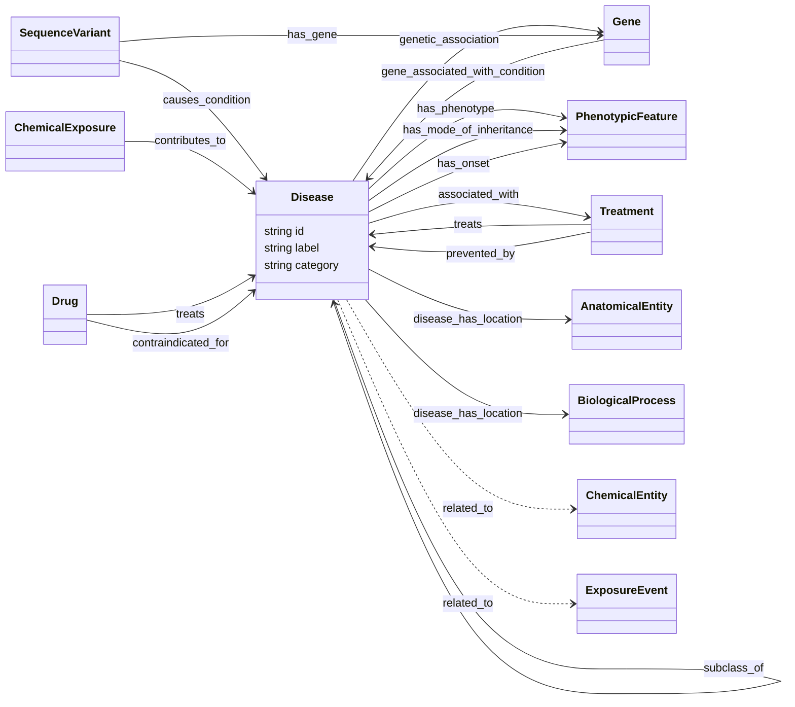

# Rare Disease Knowledge Graph Chat Transcript

👤 **User**
Give a high-level overview of the @rdkg knowledge graph, including its main entities, relationships, and purpose.

---

🧠 **Assistant**
Here's a high-level overview of the **Rare Disease Knowledge Graph** (`rdkg`):

**What it is.** RDKG is an open knowledge graph that harmonizes rare disease entities and their cross-references across major biomedical terminologies — the MONDO Disease Ontology, Orphanet/ORDO, OMIM phenotypic series, and UMLS. It is built to support rare disease knowledge discovery, entity linking across sources, and downstream analytics for evidence synthesis.

**Domain.** Rare disease · clinical genetics · disease harmonization. Diseases are identified through MONDO, Orphanet, OMIM, and UMLS; genes through NCBI Gene; and phenotypes and inheritance patterns through the Human Phenotype Ontology (HPO).

**Core entity types.** The schema uses Biolink Model classes, centered on `Disease`. Around it are `Gene` and `SequenceVariant` (the genetic basis of disease), `PhenotypicFeature` (clinical features, mode of inheritance, and onset), `Drug` and `Treatment` (therapeutic options), and contextual entities `AnatomicalEntity`, `BiologicalProcess`, `ChemicalEntity`, `ChemicalExposure`, and `ExposureEvent`.

**Relationships.** Diseases are organized into `subclass_of` hierarchies and linked to phenotypes (`has_phenotype`), inheritance (`has_mode_of_inheritance`), and onset (`has_onset`). The genetic layer connects genes and variants to disease via `gene_associated_with_condition`, `genetic_association`, `causes_condition`, and `has_gene`. The therapeutic layer uses `treats`, `contraindicated_for`, and `prevented_by`, while `disease_has_location`, `contributes_to`, and the general `related_to` capture anatomical, environmental, and other associations.

**What it can answer.** The graph supports questions such as: which genes and variants are associated with a given rare disease; what phenotypes, inheritance mode, and onset characterize it; which drugs treat it or are contraindicated; and how a rare disease is cross-referenced across MONDO, Orphanet, OMIM, and UMLS.

**Access.** SPARQL endpoint at `https://apps.okn.us/rdkg/sparql`.

---

👤 **User**
Visualize the schema as a class diagram.

---

🧠 **Assistant**
Here's the schema, centered on `Disease`, showing the genetic, phenotypic, therapeutic, and contextual relationships:

**Reading the diagram.** Every entity carries `id`, `label`, and Biolink `category` (shown once on `Disease` to reduce clutter). `Disease` is the hub: it is organized into `subclass_of` hierarchies and linked outward to phenotypes, genetics, anatomy, and treatments. Genes and sequence variants point into disease through the genetic predicates, and drugs and treatments through the therapeutic predicates. The dashed `related_to` edges are general associations used where a more specific predicate does not apply.
