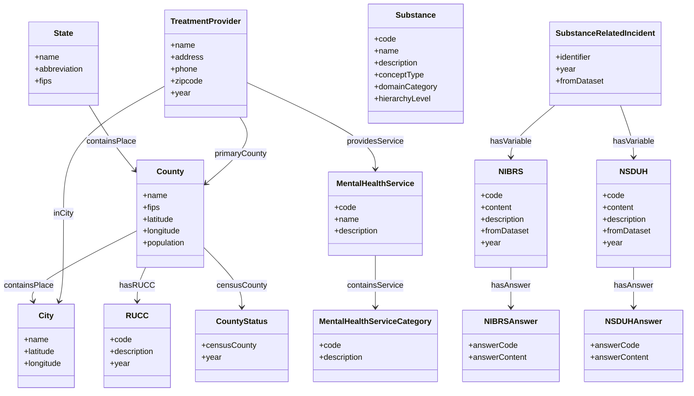

# Rural Resilience Knowledge Graph - Exploration Session

👤 **User**  
@ruralkg

---

🧠 **Assistant**  
I'll help you explore the Rural Knowledge Graph! Let me start by getting some information about it.

The **Rural Resilience Knowledge Graph** is a cross-domain knowledge graph to integrate health and justice for rural resilience.

The Rural Resilience Knowledge Graph (RuralKG) is a cross-domain semantic resource designed for researchers, policymakers, and public health professionals studying health disparities and justice outcomes in rural America. It integrates substance abuse data from the National Survey on Drug Use and Health (NSDUH), criminal justice incidents from the National Incident-Based Reporting System (NIBRS), mental health treatment provider locations, and geospatial administrative boundaries spanning 56 states/territories, 3,253 counties, and 31,120 cities. Each county is linked to USDA Rural-Urban Continuum Codes (RUCC) to facilitate rural-urban comparative analyses. The graph contains 815,852 triples describing 67,191 entities across 16 classes, with rich connections between treatment providers (9,037) and 176 mental health services. RuralKG uses a native ontology (sail.ua.edu/ruralkg) and provides standard SPARQL access for federated querying, supporting interdisciplinary research on rural health equity, substance abuse patterns, and justice system interactions.

## What's in this Knowledge Graph?

The Rural Resilience KG integrates several key datasets:

**Key Data Domains:**
- **Geographic Areas**: 56 states/territories, 3,253 counties, and 31,120 cities with FIPS codes and coordinates
- **Substance Abuse Data**: From the National Survey on Drug Use and Health (NSDUH)
- **Criminal Justice**: Incident data from the National Incident-Based Reporting System (NIBRS)
- **Mental Health Services**: 9,037 treatment providers offering 176 different mental health services
- **Rural-Urban Classification**: Counties linked to USDA Rural-Urban Continuum Codes (RUCC) for comparative analyses

**The Graph Contains:**
- 815,852 triples describing 67,191 entities across 16 classes
- Rich connections between treatment providers, services, geographic areas, and incident data

## What Can You Explore?

I can help you query this knowledge graph to answer questions like:
- Where are mental health treatment providers located in rural vs urban counties?
- What substance abuse patterns exist in different geographic areas?
- How do criminal justice incidents relate to substance abuse and treatment availability?
- What services are available in specific counties or cities?
- How do rural-urban continuum codes correlate with health outcomes?

**Would you like to explore any specific aspect of rural health, justice, or treatment services?** For example, I could help you find treatment providers in a specific state, analyze substance abuse patterns, or compare rural vs urban areas.

---

👤 **User**  
Visualize the schema

---

🧠 **Assistant**  

## Schema Overview

The Rural Resilience Knowledge Graph has four main interconnected domains:

**1. Geographic Hierarchy** (State → County → City)
- States contain counties, counties contain cities
- Counties are classified by RUCC (Rural-Urban Continuum Codes) for rural-urban analysis

**2. Treatment & Services**
- Treatment providers are located in cities and counties
- Providers offer mental health services organized into categories

**3. Substance Abuse Data**
- Substance entities with hierarchical classifications
- Substance-related incidents tracked with NSDUH and NIBRS variables

**4. Survey & Incident Variables**
- **NSDUH** (National Survey on Drug Use and Health) variables with answer values
- **NIBRS** (National Incident-Based Reporting System) variables with answer values

This structure enables research on how geographic location (especially rural vs urban), treatment availability, and substance abuse patterns intersect with criminal justice outcomes.

---

👤 **User**  
create transcript

---

*Created by [mcp-proto-okn](https://github.com/sbl-sdsc/mcp-proto-okn) 0.4.0 using claude-sonnet-4-20250514 on 2025-12-21*
