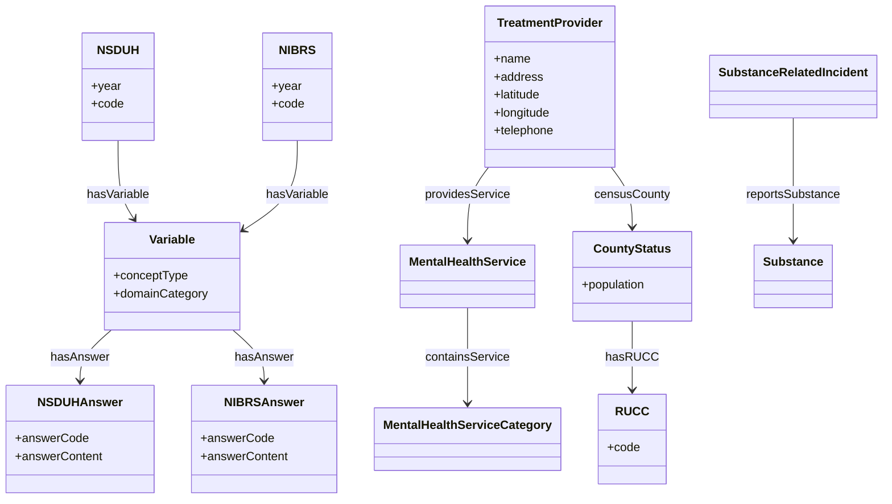

# Rural Resilience Knowledge Graph (RuralKG) Exploration

## Chat Transcript

👤 **User**  
@ruralkg

---

🧠 **Assistant**  
I'll help you explore the ruralkg (Rural Resilience Knowledge Graph) graph. Let me fetch its schema and probe the live endpoint for the classes and predicates in use.

**RuralKG** is a cross-domain resource for studying health disparities and justice outcomes in rural America. It integrates substance-use survey data (**NSDUH**), criminal-justice incident data (**NIBRS**), mental-health **treatment providers**, and county-level **rural–urban classification** (USDA Rural-Urban Continuum Codes). It uses a native ontology (`sail.ua.edu/ruralkg`) for its survey/treatment model and **schema.org** for provider locations.

Live class counts:
- **~14,923 `NSDUHAnswer`** and **~2,464 `NSDUH`** — survey variables and their response values
- **~2,258 `NIBRSAnswer`** and **~469 `NIBRS`** — incident-report variables and values
- **~9,037 `TreatmentProvider`** with **176 `MentalHealthService`** across **21 `MentalHealthServiceCategory`**
- **~3,234 `CountyStatus`** and **10 `RUCC`** — per-county status linked to Rural-Urban Continuum Codes
- **23 `Substance`** and **17 `SubstanceRelatedIncident`**

**Main relationships:**
- `hasVariable` / `hasAnswer` — a dataset (`NSDUH` / `NIBRS`) has variables, and each variable has coded answers (`answerCode`, `answerContent`)
- `providesService` / `containsService` — a `TreatmentProvider` provides `MentalHealthService`s grouped into categories
- `censusCounty` / `hasRUCC` — link county status to its census county and RUCC rural–urban code
- schema.org `name`, `address`, `latitude`, `longitude`, `postalCode`, `telephone`, `containedInPlace`, `serviceLocation` — provider descriptors and geolocation

Would you like me to:
1. Visualize the schema structure?
2. Compare substance-use survey responses across rural vs urban counties (via RUCC)?
3. Map mental-health treatment providers by county?

---

👤 **User**  
Visualize the schema

---

🧠 **Assistant**  
Here's the live schema of RuralKG — survey and incident datasets with coded answers, treatment providers and services, and county rural–urban classification:

```mermaid
classDiagram
    class NSDUH {
        +year
        +code
    }
    class NIBRS {
        +year
        +code
    }
    class Variable {
        +conceptType
        +domainCategory
    }
    class NSDUHAnswer {
        +answerCode
        +answerContent
    }
    class NIBRSAnswer {
        +answerCode
        +answerContent
    }
    class TreatmentProvider {
        +name
        +address
        +latitude
        +longitude
        +telephone
    }
    class MentalHealthService
    class MentalHealthServiceCategory
    class Substance
    class SubstanceRelatedIncident
    class CountyStatus {
        +population
    }
    class RUCC {
        +code
    }

    NSDUH --> Variable : hasVariable
    NIBRS --> Variable : hasVariable
    Variable --> NSDUHAnswer : hasAnswer
    Variable --> NIBRSAnswer : hasAnswer
    TreatmentProvider --> MentalHealthService : providesService
    MentalHealthService --> MentalHealthServiceCategory : containsService
    TreatmentProvider --> CountyStatus : censusCounty
    CountyStatus --> RUCC : hasRUCC
    SubstanceRelatedIncident --> Substance : reportsSubstance
```

**Key insights from the schema:**

1. **Two survey/incident backbones.** `NSDUH` (substance-use survey) and `NIBRS` (incident reporting) are each modeled as datasets with `Variable`s and coded `Answer`s (`answerCode` / `answerContent`), so responses can be sliced by variable and value.

2. **Treatment-provider network.** ~9,037 `TreatmentProvider`s offer `MentalHealthService`s (grouped by category) and are geolocated via schema.org properties (`address`, `latitude`, `longitude`, `postalCode`, `telephone`) — enabling provider mapping and access analysis.

3. **Rural–urban classification.** County-level `CountyStatus` links to USDA `RUCC` codes through `hasRUCC` and to census counties via `censusCounty`, the key axis for rural-vs-urban comparisons. (Earlier native `County`/`City`/`State` classes and predicates such as `fips`, `containsPlace`, `primaryCounty`, and `inCity` have been superseded by this county-status model plus schema.org locations.)

4. **Interdisciplinary joins.** Substance-use, justice, treatment, and geography share the county axis, supporting questions that connect rural status to substance-use patterns, incident rates, and treatment availability.

---

👤 **User**  
Create transcript

---

*Created by [mcp-proto-okn](https://github.com/sbl-sdsc/mcp-proto-okn) 0.6.0 using claude-opus-4-8 on 2026-07-12*
