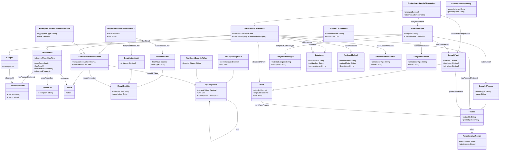

# SAWGraph Knowledge Graph Exploration - Chat Transcript

**Date:** December 11, 2025

---

## Conversation Summary

This transcript documents an exploration of the SAWGraph (Safe Agricultural Products and Water Graph) PFAS knowledge graph, including retrieval of its schema and creation of a comprehensive class diagram.

---

## User Request #1

**User:**

> @sawgraph

---

## Assistant Response #1

I'll help you explore the sawgraph knowledge graph. Let me start by getting information about what this knowledge graph contains.

**Tool Call:** `sawgraph:get_description`

### SAWGraph Description

**Source:** https://raw.githubusercontent.com/frink-okn/okn-registry/refs/heads/main/docs/registry/kgs/sawgraph.md

**Title:** SAWGraph PFAS graph

**Description:** The Safe Agricultural Products and Water Graph (SAWGraph) PFAS graph stores data on PFAS observations and releases, describing the samples, the geospatial features they were taken from, the sampled environmental media, the specific chemical substances and the measurement values observed.

**Key Information:**
- **Homepage:** https://sawgraph.github.io/
- **Funding:** NSF Award #2333782
- **SPARQL Endpoint:** https://frink.apps.renci.org/sawgraph/sparql
- **Contact:** Katrina Schweikert (katrina.schweikert@maine.edu)

### Overview

SAWGraph is an open knowledge network to monitor and trace PFAS and other contaminants in the nation's food and water systems. The PFAS graph stores data on PFAS observations and releases, describing:

- **Samples:** Physical samples from the environment
- **Geospatial Features:** Wells, water bodies, facilities, fields
- **Environmental Media:** Drinking water, wastewater, soil, animal or plant tissue
- **Chemical Substances:** Over 30 different PFAS substances
- **Measurement Values:** Concentrations, detection limits, lab qualifiers

**Current Data Coverage:**
- Maine data from the EGAD dataset
- Water Quality Portal (WQP) data from select other states

### Target Users

SAWGraph is designed for:
- Environmental health researchers
- Regulatory agencies
- Public health officials

### Data Integration

The knowledge graph integrates:
- **Contamination measurements** from Maine's EGAD drinking water monitoring program
- **National Water Quality Portal data**
- **Food products** via FOODON taxonomy (meat, dairy, produce, seafood)
- **Geographic locations** (administrative regions)
- **Taxonomic entities** via NCBITaxon (organisms)
- **Contaminoso ontology (COSO)** for standardized contamination modeling
- **External identifiers** via ComptoxAI substance links and CAS numbers

**Tool Call:** `sawgraph:get_schema` (compact=true)

### Schema Summary

**Total Classes:** 34
**Total Predicates:** 23

#### Key Classes

**Core Observation Classes:**
- Observation
- FeatureOfInterest
- Procedure
- Result
- Sample

**Contaminant-Specific Classes:**
- ContaminantObservation
- ContaminantSampleObservation
- ContaminantMeasurement
- SingleContaminantMeasurement
- AggregateContaminantMeasurement

**Measurement Quality Classes:**
- DetectQuantityValue
- NonDetectQuantityValue
- DetectionLimit
- QuantitationLimit
- ResultQualifier

**Sample Classes:**
- MaterialSample
- SamplePoint
- SampledFeature
- SampleMaterialType
- SampleAnnotation

**Substance Classes:**
- Substance
- SubstanceCollection

**Spatial Classes:**
- Feature
- Point
- AdministrativeRegion

**Analysis Classes:**
- AnalysisMethod
- ObservationAnnotation
- ContaminationProperty
- QuantityValue

#### Key Predicates

**Observation Relationships:**
- `analyzedSample` - Links observation to sample analyzed
- `hasFeatureOfInterest` - Links to geographic feature
- `hasResult` - Links to measurement result
- `ofSubstance` - Links to PFAS substance
- `observedTime` - Timestamp of observation
- `observedAtPoint` - Geographic point location
- `observedAtSamplePoint` - Sample collection point

**Sample Relationships:**
- `fromSamplePoint` - Sample location
- `sampleOfMaterialType` - Type of material sampled
- `sampleAnnotation` - Sample metadata

**Substance Relationships:**
- `substanceID` - Unique identifier
- `casNumber` - CAS registry number

**Measurement Relationships:**
- `measurementValue` - Numeric measurement
- `measurementUnit` - Unit of measure
- `resultAnnotation` - Qualifier metadata

**Spatial Relationships:**
- `pointFromFeature` - Point within larger feature

**Analysis Relationships:**
- `usedProcedure` - Analysis method used

### What You Can Query

The knowledge graph enables exploration of:

1. **PFAS contamination levels** in different locations
2. **Substance detection patterns** - which PFAS were found and where
3. **Temporal trends** in contamination over time
4. **Sample location relationships** to contamination levels
5. **Material types** sampled (water, soil, tissue, etc.)
6. **Analysis methods** used for detection
7. **Geographic patterns** across administrative regions
8. **Detection vs. non-detection** patterns
9. **Measurement quality** indicators (detection limits, qualifiers)

Would you like me to run some example queries? For instance, I could:
- Show you what PFAS substances are tracked
- Find contamination observations in specific locations
- Analyze detection patterns
- Explore the types of environmental media sampled

---

## User Request #2

**User:** 

> create class diagram

---

## Assistant Response #2

I'll create a comprehensive class diagram for the SAWGraph knowledge graph showing the main classes and their relationships.

**Tool Calls:**
1. Queried for OWL class definitions
2. Queried for object property relationships
3. Created Mermaid class diagram
4. Cleaned diagram to remove problematic note statements

### Class Diagram Created

The class diagram includes:

#### Core SOSA/SSN Pattern
- **Observation** - Base class for all observations with timestamp, procedure, results
- **FeatureOfInterest** - The thing being observed
- **Procedure** - Analysis methods used
- **Result** - Observation outcomes
- **Sample** - Physical samples collected

#### Contaminant Observation Classes
- **ContaminantObservation** - PFAS and contaminant observations
- **ContaminantSampleObservation** - Observations from physical samples

#### Measurement Classes
- **ContaminantMeasurement** - Base measurement class
- **SingleContaminantMeasurement** - Individual substance measurement
- **AggregateContaminantMeasurement** - Combined measurements
- **DetectQuantityValue** - Detected contamination values
- **NonDetectQuantityValue** - Below detection limit results

#### Quality and Limits
- **DetectionLimit** - Minimum detectable concentration
- **QuantitationLimit** - Minimum quantifiable concentration
- **ResultQualifier** - Lab quality codes and flags

#### Sample Classes
- **MaterialSample** - Physical environmental samples
- **SamplePoint** - Geographic coordinates of sample location
- **SampledFeature** - Feature where sample was taken (well, water body, etc.)
- **SampleMaterialType** - Type of material (water, soil, tissue)

#### Substance Classes
- **Substance** - Individual PFAS chemicals with CAS numbers
- **SubstanceCollection** - Groups of substances

#### Spatial Classes
- **Feature** - Geographic features
- **Point** - Coordinate locations
- **AdministrativeRegion** - Counties, states, administrative boundaries

#### Analysis and Annotation Classes
- **AnalysisMethod** - Laboratory analysis procedures
- **ObservationAnnotation** - Observation metadata
- **SampleAnnotation** - Sample metadata
- **ContaminationProperty** - Observable contamination characteristics
- **QuantityValue** - Numeric values with units

### Key Relationships Shown

**Inheritance (--|>):**
- ContaminantObservation extends Observation
- ContaminantSampleObservation extends ContaminantObservation
- SingleContaminantMeasurement and AggregateContaminantMeasurement extend ContaminantMeasurement
- MaterialSample extends Sample
- DetectionLimit and QuantitationLimit extend ResultQualifier

**Associations (-->):**
- ContaminantObservation links to Substance (what was measured)
- ContaminantObservation links to ContaminantMeasurement (results)
- ContaminantObservation links to Feature (where it was observed)
- ContaminantSampleObservation links to MaterialSample (what was analyzed)
- MaterialSample links to SamplePoint (where collected)
- MaterialSample links to SampledFeature (what was sampled)
- MaterialSample links to SampleMaterialType (type of material)

### Diagram Features

The class diagram illustrates:

1. **Standard observation pattern** based on SOSA/SSN ontologies
2. **Specialization for contaminants** with PFAS-specific classes
3. **Rich metadata** for quality control and validation
4. **Spatial integration** linking observations to geographic features
5. **Complete data lineage** from sample collection through analysis to results
6. **Quality indicators** including detection limits and lab qualifiers

This structure enables comprehensive tracking of PFAS contamination from environmental samples through laboratory analysis and reporting, supporting food safety assessments and regulatory compliance tracking.

---

## Files Generated

1. **sawgraph_class_diagram.mermaid** - Mermaid class diagram showing the complete ontology structure with classes, attributes, inheritance relationships, and associations

---

## Technical Notes

- All queries used the FRINK SPARQL endpoint at `https://frink.apps.renci.org/sawgraph/sparql`
- Schema retrieved using compact format for efficient representation
- Class diagram follows UML notation in Mermaid syntax
- Diagram includes 26 main classes with full inheritance hierarchy and relationship mappings

---

## Key Insights

1. **Standards-Based Design:** SAWGraph uses SOSA/SSN (Semantic Sensor Network) ontology as its foundation, ensuring interoperability

2. **Comprehensive Quality Control:** The knowledge graph captures detection limits, quantitation limits, and result qualifiers to ensure data quality

3. **Spatial Integration:** Strong integration with geographic features at multiple scales (points, features, administrative regions)

4. **Flexible Measurement Model:** Supports both single and aggregate measurements, as well as detect/non-detect results

5. **Rich Metadata:** Extensive annotation capabilities for both observations and samples to preserve contextual information

6. **Food Safety Focus:** Integration with FOODON taxonomy enables tracking contaminants through the food supply chain

---

**End of Transcript**
