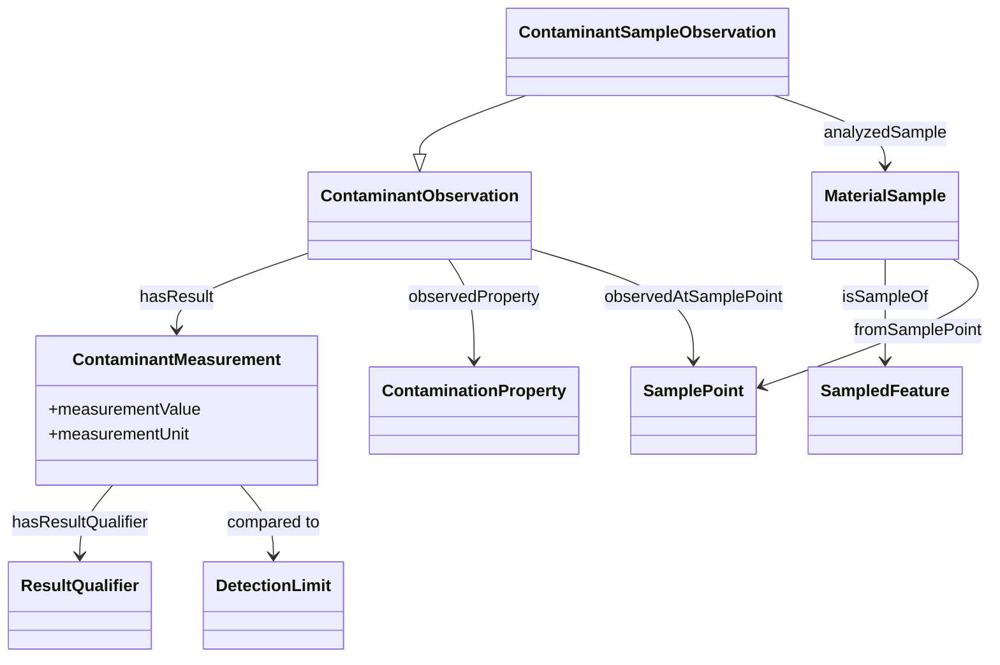

# SAWGraph PFAS / Contaminant Knowledge Graph Exploration

## Chat Transcript

👤 **User**  
@sawgraph

---

🧠 **Assistant**  
I'll help you explore the sawgraph knowledge graph. Let me fetch its schema and probe the live endpoint for the classes and predicates in use.

**SAWGraph** represents environmental **contaminant observations and samples** — with a focus on PFAS — using the **Contaminant Observation and Samples Ontology (ContaminOSO / `coso`)** together with SOSA/SSN observations, QUDT quantities, and GeoSPARQL geometry. It integrates federal **Water Quality Portal (WQP)** results and Maine **EGAD** monitoring data over a shared observation/measurement model.

Live class counts:
- **~705 K `ContaminantObservation` / `ContaminantSampleObservation`** and matching **`sosa:Observation` / `sosa:Result`**
- **~834 K `qudt:Quantity` / `stad:Datapoint`** and **~705 K `ContaminantMeasurement`** (absolute / relative) with `QuantityValue`s
- **Material samples** of many kinds: `Water Sample` (drinking/ground/raw/filtered), `Soil Sample`, `Sediment Sample`, animal (blood/milk/organ/tissue) and plant samples, `Biota Sample`
- Features & limits: `Feature`, `Monitored Feature`, `Release Feature`, `Sample Point`, `Detection Limit`, `Quantitation Limit`, `Contamination Property`
- Source-specific classes from **WQP** (`WQP - Characteristic`, `WQP - Sample`, `WQP - Project`, `WQP - Location Type`) and **Maine EGAD**

**Main relationships:**
- `has result` — a `ContaminantObservation` yields a `ContaminantMeasurement` (with `measurement value`, `measurement unit`, `has result qualifier`)
- `analyzed sample` — a `ContaminantSampleObservation` analyzes a `Material Sample`
- `observed property` / `of substance` — the contamination property and chemical substance observed
- `is sample of` / `from sample point` / `sample of material type` — sample provenance
- `observed at sample point` / `observed at point` — where the observation was made
- WQP/EGAD predicates (e.g. `wqp - characteristic group name`, `wqp - has project id`, `egad - method detection limit`, `egad - reporting limit`)

Would you like me to:
1. Visualize the schema structure?
2. Find PFAS measurements above a detection limit in a region?
3. Compare contaminant levels across sample media (water, soil, biota)?

---

👤 **User**  
Visualize the schema

---

🧠 **Assistant**  
Here's the live schema of SAWGraph — contaminant observations producing measurements from analyzed material samples, integrating WQP and EGAD data:

```mermaid
classDiagram
    class ContaminantObservation
    class ContaminantSampleObservation
    class ContaminantMeasurement {
        +measurementValue
        +measurementUnit
    }
    class MaterialSample
    class SamplePoint
    class SampledFeature
    class ContaminationProperty
    class ResultQualifier
    class DetectionLimit

    ContaminantSampleObservation --|> ContaminantObservation
    ContaminantObservation --> ContaminantMeasurement : hasResult
    ContaminantObservation --> ContaminationProperty : observedProperty
    ContaminantObservation --> SamplePoint : observedAtSamplePoint
    ContaminantSampleObservation --> MaterialSample : analyzedSample
    MaterialSample --> SampledFeature : isSampleOf
    MaterialSample --> SamplePoint : fromSamplePoint
    ContaminantMeasurement --> ResultQualifier : hasResultQualifier
    ContaminantMeasurement --> DetectionLimit : compared to
```

**Key insights from the schema:**

1. **Observation → measurement → sample.** The COSO core: a `ContaminantObservation` (often a `ContaminantSampleObservation`) `has result` a `ContaminantMeasurement`, and analyzes a `Material Sample` taken from a `Sampled Feature` at a `Sample Point` — a clean chain from field sample to reported value.

2. **Media-typed samples.** Samples are richly subtyped (drinking/ground/raw/filtered water, soil, sediment, animal blood/milk/organ/tissue, plant, biota), enabling exposure analysis by medium — central to PFAS contamination studies.

3. **Detection handling.** `Detection Limit` / `Quantitation Limit` and `Result Qualifier` (with detect vs non-detect quantity values) make censored measurements explicit, so queries can distinguish true detections from non-detects.

4. **Multi-source integration.** Federal WQP and Maine EGAD data are aligned onto the same COSO model (via the `us-wqp` and `me-egad` vocabularies), and shared DSSTox substance and S2/geometry identifiers make SAWGraph joinable to the facility (FIO) and hydrology graphs.

---

👤 **User**  
Create transcript

---

*Created by [mcp-proto-okn](https://github.com/sbl-sdsc/mcp-proto-okn) 0.6.0 using claude-opus-4-8 on 2026-07-12*
