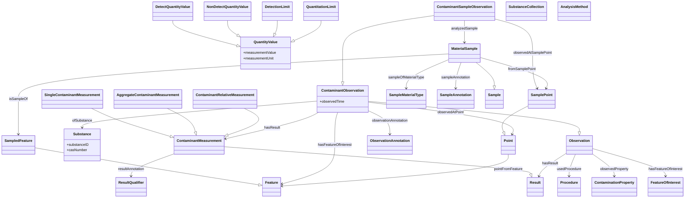

# Chat Transcript: SAWGraph PFAS Knowledge Graph Exploration

👤 **User**  
@sawgraph

---

🧠 **Assistant**  
I'll help you explore the sawgraph knowledge graph! Let me start by getting information about this knowledge graph.

Great! I now have access to the **SAWGraph PFAS Knowledge Graph** - a specialized knowledge graph for tracking PFAS (per- and polyfluoroalkyl substances) and other contaminants in food and water systems.

## What I can help you with:

**Data Available:**
- PFAS contamination measurements from Maine's EGAD drinking water monitoring and the national Water Quality Portal
- Chemical substance information (with DSSTox IDs and CAS numbers)
- Geographic locations and sampled features (wells, water bodies, facilities, fields)
- Environmental media (groundwater, surface water, wastewater, soil, tissue)
- Food products categorized by FOODON taxonomy (meat, dairy, produce, seafood)
- Measurement values, detection limits, and validation levels

**Example Queries I Can Run:**
- Find PFAS observations in specific locations
- Analyze concentration levels of specific chemicals
- Compare contamination across different environmental media
- Track substances by their CAS numbers or substance IDs
- Explore food safety data for different product types
- Investigate spatial patterns of contamination

What would you like to explore? For example, I could:
1. Show you the highest PFAS concentrations detected
2. Find observations from specific geographic areas
3. Analyze contamination in specific food types
4. Search for specific chemical substances
5. Explore contamination in different water sources

Just let me know what interests you!

---

👤 **User**  
Visualize the schema

---

🧠 **Assistant**  
I've created a visualization of the SAWGraph schema! The diagram shows the key classes and their relationships in the knowledge graph.

**Key components:**

- **Observations**: `ContaminantObservation` and `ContaminantSampleObservation` track when and where contaminants were detected
- **Measurements**: Different types like `SingleContaminantMeasurement` and `AggregateContaminantMeasurement` store the actual values
- **Substances**: Chemical substances with identifiers (CAS numbers, substance IDs)
- **Samples**: `MaterialSample` represents physical samples with associated metadata
- **Locations**: `Point`, `SamplePoint`, `Feature`, and `SampledFeature` capture geographic information
- **Quality control**: `DetectionLimit`, `QuantitationLimit`, and various annotations ensure data quality

The diagram is now available as a downloadable .mermaid file that will render interactively!

---

*Created by [mcp-proto-okn](https://github.com/sbl-sdsc/mcp-proto-okn) 0.4.0 for sawgraph on 2024-12-24*

claude-sonnet-4-20250514