# SCALES Knowledge Graph Overview and Class Diagram

## Chat Transcript

### Introduction to SCALES

**Date:** December 15, 2025

**Overview:**  
SCALES (Systematic Content Analysis of Litigation Events) is an open knowledge network designed to democratize access to criminal and civil court records across the United States.

---

## SCALES Knowledge Graph Description

### Project Information

- **Endpoint:** https://frink.apps.renci.org/scales/sparql
- **Homepage:** https://scales-okn.org/
- **Funding:** NSF Award #2333803
- **Statistics:** https://frink.renci.org/kg-stats/scales-kg

### Principal Investigators

- **Danny O'Neal** - danny.e.oneal@gmail.com
- **Scott Daniel** - scottgdaniel@gmail.com

### Knowledge Graph Statistics

The SCALES knowledge graph contains:

- **523+ million triples** describing relationships between entities
- **96.5 million entities** across the justice system
- **4.1+ million cases** total
  - 2.4 million criminal cases
  - 1.8 million civil cases
- Data from **federal district courts** and **state/local court systems**

### Data Coverage

The knowledge graph integrates and links:

- **Parties** (plaintiffs, defendants, organizations)
- **Attorneys** (defense, prosecution, civil representatives)
- **Law Firms**
- **Judges**
- **Charges** (criminal and civil)
- **Sentences** (imprisonment, probation, fines)
- **Arrests**
- **Bookings** (jail intakes)
- **Courts** (federal, state, local)
- **Docket Entries** (case actions and filings)

### Standards and Purpose

Built on the **National Information Exchange Model (NIEM) Justice Domain** standard, SCALES employs standardized vocabularies to:

- Enable systematic analysis of justice system functioning
- Reveal inequities in the criminal justice system
- Support evidence-based policy making
- Address the critical lack of nationally-accessible and linked criminal justice data

---

## Schema Overview

### Main Entity Classes (24 total)

#### Case Types
1. **CriminalCase** - Criminal court cases
2. **CivilCase** - Civil court cases

#### People
3. **Person** - Individual people in the system
4. **Judge** - Judicial officials
5. **Attorney** - Legal counsel
6. **CaseDefendantParty** - Defendants in cases
7. **CaseInitiatingParty** - Plaintiffs/prosecutors
8. **CaseDefenseAttorney** - Defense attorneys on cases
9. **CaseInitiatingAttorney** - Prosecuting/plaintiff attorneys
10. **CaseJudge** - Judges assigned to cases
11. **LawEnforcementOfficial** - Police and law enforcement

#### Organizations
12. **Firm** - Law firms
13. **Party** - Legal parties (persons or organizations)
14. **Court** - Courthouses and judicial venues
15. **BookingFacility** - Jails and detention facilities

#### Legal Entities
16. **Charge** - Criminal or civil charges
17. **ArrestCharge** - Charges at time of arrest
18. **Sentence** - Court-ordered sentences
19. **SentenceTerm** - Components of sentences
20. **Arrest** - Arrest events
21. **Booking** - Jail booking/intake events
22. **Release** - Release from custody events

#### Documents
23. **RegisterOfActions** - Docket tables
24. **RegisterAction** - Individual docket entries

### Key Properties (259 total predicates)

The knowledge graph includes properties for:

#### Case Information
- Docket IDs and case numbers
- Filing dates, start dates, end dates
- Case status and disposition
- Court circuits and jurisdictions
- Case categories and types

#### Charge Details
- Offense codes (NIBRS, UCR)
- Charge text and descriptions
- Severity levels (felony, misdemeanor)
- Disposition outcomes
- Statute references

#### Sentencing Information
- Prison terms and duration
- Probation periods
- Fine amounts
- Restitution orders
- Supervised release terms

#### Person Demographics
- Full names and IDs
- Race and ethnicity
- Sex/gender
- Birth year
- Residence information

#### Geographic Data
- Court locations and postal codes
- County codes (FIPS)
- Census block IDs
- Facility addresses

#### Professional Relationships
- Attorney-client assignments
- Judge assignments to cases
- Firm affiliations
- Party representations

---

## Example Data

### Sample Criminal Case
- **Case ID:** akd;;1:16-cr-00001
- **Docket:** 1:16-cr-00001
- **District:** akd (Alaska District)
- **Circuit:** 9.0 (Ninth Circuit)
- **Filed:** 2016-02-03
- **Closed:** 2016-08-04
- **Status:** closed

### Sample Charges
1. **26:7203 WILLFUL FAILURE TO FILE INCOME TAX RETURNS**
   - Counts: 1-3
   - Disposition: 12 months 1 day imprisonment; 1 year Supervised Release; $600,064.00 Restitution; $100.00 Special Assessment

2. **18:2252(a)(2) and (b)** 
   - Count: 1
   - Disposition: 60 months imprisonment; 20 years supervised release; $100 special assessment; property forfeiture

3. **18:1159(a) AND (b)(1)(B)(I) MISREPRESENTATION OF INDIAN PRODUCED GOODS**
   - Counts: 1-2
   - Disposition: 5 years Probation; $4000.00 Fine; $4000.00 Restitution; $50.00 Special Assessment

### Sample Person Data
Persons include demographic information:
- **Sex Code:** M/F
- **Race Text:** B (Black), W (White), etc.
- **Birth Year:** e.g., 1975, 1992, 1980

---

## SCALES Knowledge Graph Class Diagram

```mermaid
classDiagram
    %% Core Case Classes
    class CriminalCase {
        +CaseDocketID: string
        +CaseGeneralCategoryText: string
        +StartDate: date
        +EndDate: date
        +StatusDescriptionText: string
        +hasIdbCircuit: float
        +hasIdbCounty: float
    }
    
    class CivilCase {
        +CaseDocketID: string
        +CaseGeneralCategoryText: string
        +CaseSubCategoryText: string
        +StartDate: date
        +EndDate: date
    }
    
    %% Legal Entities
    class Charge {
        +ChargeText: string
        +ChargeSequenceID: string
        +ChargeDisposition: string
        +ChargeDispositionCategoryText: string
        +ChargeSeverityLevelCode: string
        +hasChargeType: string
    }
    
    class Sentence {
        +SentenceDescriptionText: string
    }
    
    class SentenceTerm {
        +TermDuration: string
    }
    
    class Arrest {
        +ActivityDate: date
    }
    
    class ArrestCharge {
        +ChargeText: string
    }
    
    class Booking {
        +ActivityDate: date
    }
    
    class Release {
        +ActivityDate: date
        +BondAmount: decimal
        +BondType: string
    }
    
    %% People and Organizations
    class Person {
        +PersonFullName: string
        +PersonID: string
        +PersonRaceText: string
        +PersonSexText: string
        +PersonSexCode: string
        +BirthYear: string
    }
    
    class Attorney {
        +PersonFullName: string
        +OrganizationName: string
    }
    
    class Judge {
        +PersonFullName: string
        +JudicialOfficialCategoryText: string
        +hasUVAJudgeDirID: string
        +hasCommissionDate: date
    }
    
    class CaseDefendantParty {
        +ParticipantRoleCategoryText: string
    }
    
    class CaseInitiatingParty {
        +ParticipantRoleCategoryText: string
    }
    
    class CaseDefenseAttorney {
        +CaseOfficialRoleText: string
    }
    
    class CaseInitiatingAttorney {
        +CaseOfficialRoleText: string
    }
    
    class CaseJudge {
        +CaseOfficialRoleText: string
    }
    
    class Firm {
        +EntityName: string
        +OrganizationName: string
    }
    
    class Party {
        +PersonFullName: string
        +EntityName: string
    }
    
    class LawEnforcementOfficial {
        +PersonFullName: string
    }
    
    %% Locations and Courts
    class Court {
        +CourtName: string
        +CourtCategoryCode: string
        +CourtPostalCode: string
        +JurisdictionText: string
        +isInCircuit: string
    }
    
    class BookingFacility {
        +FacilityName: string
        +AddressPostalCode: string
    }
    
    %% Documents
    class RegisterOfActions {
        +AdministrativeID: string
    }
    
    class RegisterAction {
        +RegisterActionDate: date
        +RegisterActionDescriptionText: string
    }
    
    %% Relationships - Criminal Case
    CriminalCase "1" --> "0..*" Charge : CaseCharge
    CriminalCase "1" --> "1" Court : CaseCourt
    CriminalCase "1" --> "0..*" CaseDefendantParty : CaseDefendantParty
    CriminalCase "1" --> "0..*" CaseInitiatingParty : CaseInitiatingParty
    CriminalCase "1" --> "0..*" CaseJudge : CaseJudge
    CriminalCase "1" --> "0..1" RegisterOfActions : DocketTable
    
    %% Relationships - Civil Case
    CivilCase "1" --> "1" Court : CaseCourt
    CivilCase "1" --> "0..*" Party : CaseInitiatingParty
    CivilCase "1" --> "0..*" Party : CaseDefendantParty
    CivilCase "1" --> "0..*" CaseJudge : CaseJudge
    
    %% Relationships - Charge
    Charge "0..*" --> "0..1" Sentence : ChargeSentence
    Charge "0..*" --> "1" Person : ChargeSubject
    Charge "0..*" --> "0..1" Booking : ChargeBooking
    
    %% Relationships - Sentence
    Sentence "1" --> "0..*" SentenceTerm : SentenceTerm
    
    %% Relationships - Arrest and Booking
    Arrest "1" --> "1" Person : ChargeSubject
    Arrest "1" --> "0..*" ArrestCharge : PersonCharge
    Arrest "1" --> "0..1" LawEnforcementOfficial : ArrestOfficial
    Arrest "1" --> "0..1" Booking : SubjectBooking
    
    Booking "1" --> "1" BookingFacility : BookingFacility
    Booking "1" --> "0..1" Release : BookingRelease
    Booking "0..*" --> "0..*" CriminalCase : BookingCase
    
    %% Relationships - People Roles
    CaseDefendantParty "1" --> "1" Person : isInstanceOfEntity
    CaseInitiatingParty "1" --> "1" Person : isInstanceOfEntity
    
    CaseDefenseAttorney "1" --> "1" Attorney : Attorney
    CaseDefenseAttorney "0..*" --> "0..1" CaseDefendantParty : assignedToDefendant
    
    CaseInitiatingAttorney "1" --> "1" Attorney : Attorney
    CaseInitiatingAttorney "0..*" --> "0..1" Party : appointedByParty
    
    CaseJudge "1" --> "1" Judge : isInstanceOfEntity
    
    %% Relationships - Organizations
    Attorney "0..*" --> "0..1" Firm : Firm
    
    %% Relationships - Documents
    RegisterOfActions "1" --> "0..*" RegisterAction : DocketEntry
    RegisterAction "0..*" --> "0..*" RegisterAction : hasReferenceToOtherEntry
```



---

## Class Diagram Explanation

### Entity Relationships

#### Criminal Case Flow
1. A **CriminalCase** has one or more **Charges**
2. Each **Charge** is associated with a **Person** (defendant)
3. **Charges** may lead to **Sentences**, which have **SentenceTerms**
4. Cases are heard in a **Court** by a **CaseJudge**
5. **CaseDefendantParty** and **CaseDefenseAttorney** represent the defense
6. **CaseInitiatingParty** and **CaseInitiatingAttorney** represent the prosecution

#### Arrest and Booking Flow
1. An **Arrest** involves a **Person** and a **LawEnforcementOfficial**
2. **Arrests** have **ArrestCharges**
3. An **Arrest** may lead to a **Booking** at a **BookingFacility**
4. **Bookings** may result in a **Release** (with bond information)
5. **Bookings** are linked to **CriminalCases**

#### Civil Case Flow
1. A **CivilCase** involves multiple **Parties** (initiating and defendant)
2. **Parties** can be represented by **Attorneys** from **Firms**
3. Cases are presided over by **Judges** via **CaseJudge** role
4. Cases are heard in specific **Courts**

#### Document Trail
1. Cases have a **RegisterOfActions** (docket table)
2. Each **RegisterAction** is a docket entry (filing, hearing, order, etc.)
3. **RegisterActions** can reference other entries

### Cardinality Notes

- **1** = Exactly one
- **0..1** = Zero or one (optional)
- **0..\*** = Zero or more (many)

For example:
- A CriminalCase has exactly **1** Court
- A CriminalCase has **0 or more** Charges
- A CriminalCase has **0 or 1** RegisterOfActions (docket table)

---

## Use Cases

### Research Applications

1. **Sentencing Disparities Analysis**
   - Compare sentences across demographics (race, gender, age)
   - Analyze geographic variations in sentencing
   - Identify patterns in charge disposition

2. **Attorney Performance Tracking**
   - Analyze case outcomes by attorney
   - Study public defender vs. private attorney effectiveness
   - Examine law firm specializations

3. **Judicial Behavior Studies**
   - Track judge assignment patterns
   - Analyze sentencing tendencies by judge
   - Study case load distributions

4. **Criminal Justice System Flow**
   - Map arrest-to-sentencing timelines
   - Analyze booking and release patterns
   - Study bail and bond decisions

5. **Geographic Justice Patterns**
   - Compare outcomes across districts and circuits
   - Analyze urban vs. rural justice administration
   - Study county-level variations

6. **Charge and Offense Analysis**
   - Track offense trends over time
   - Analyze charge reduction patterns
   - Study plea bargain outcomes

---

## SPARQL Query Examples

### Example 1: Get Cases in a Specific District

```sparql
PREFIX scales: <http://schemas.scales-okn.org/rdf/scales#>
PREFIX nc: <http://release.niem.gov/niem/niem-core/5.0/>
PREFIX jxdm: <http://release.niem.gov/niem/domains/jxdm/7.2/>

SELECT ?case ?docketID ?startDate ?status
WHERE {
  ?case a scales:CriminalCase .
  ?case nc:CaseDocketID ?docketID .
  ?case nc:StartDate ?startDate .
  ?case nc:StatusDescriptionText ?status .
  ?case scales:hasIdbDistrict "akd" .
}
LIMIT 10
```

### Example 2: Get Charges and Sentences

```sparql
PREFIX jxdm: <http://release.niem.gov/niem/domains/jxdm/7.2/>

SELECT ?charge ?chargeText ?disposition
WHERE {
  ?charge a jxdm:Charge .
  ?charge jxdm:ChargeText ?chargeText .
  ?charge jxdm:ChargeDisposition ?disposition .
}
LIMIT 10
```

### Example 3: Get Person Demographics

```sparql
PREFIX nc: <http://release.niem.gov/niem/niem-core/5.0/>
PREFIX jxdm: <http://release.niem.gov/niem/domains/jxdm/7.2/>
PREFIX scales: <http://schemas.scales-okn.org/rdf/scales#>

SELECT ?person ?race ?sex ?birthYear
WHERE {
  ?person a nc:Person .
  ?person nc:PersonRaceText ?race .
  ?person jxdm:PersonSexCode ?sex .
  ?person scales:BirthYear ?birthYear .
}
LIMIT 10
```

---

## Technical Details

### Data Standards

- **NIEM (National Information Exchange Model)** - Version 7.2 Justice Domain
- **NIEM Core** - Version 5.0
- **FBI NIBRS** - National Incident-Based Reporting System codes (2023.0)
- **FIPS Codes** - Federal Information Processing Standards for counties

### Ontology URIs

- **JXDM Namespace:** `http://release.niem.gov/niem/domains/jxdm/7.2/`
- **NIEM Core Namespace:** `http://release.niem.gov/niem/niem-core/5.0/`
- **SCALES Namespace:** `http://schemas.scales-okn.org/rdf/scales#`
- **FBI NIBRS Namespace:** `http://fbi.gov/cjis/nibrs/2023.0/`

### Access Points

- **SPARQL Endpoint:** https://frink.apps.renci.org/scales/sparql
- **Triple Pattern Fragments:** https://frink.apps.renci.org/ldf/scales
- **Statistics Dashboard:** https://frink.renci.org/kg-stats/scales-kg

---

## Contact Information

For questions, contributions, or collaborations:

- **Danny O'Neal** - danny.e.oneal@gmail.com (GitHub: @danny-oneal)
- **Scott Daniel** - scottgdaniel@gmail.com (GitHub: @scottgdaniel)

---

## Additional Resources

- **Project Homepage:** https://scales-okn.org/
- **NSF Award:** https://www.nsf.gov/awardsearch/showAward?AWD_ID=2333803
- **Documentation:** Available in the SCALES repository

---

## Summary

The SCALES knowledge graph represents one of the most comprehensive, linked datasets of criminal and civil justice records in the United States. By standardizing data across jurisdictions and connecting entities like cases, charges, people, attorneys, judges, and courts, SCALES enables researchers, policymakers, and advocates to:

- Conduct large-scale empirical studies of the justice system
- Identify and measure disparities in outcomes
- Track the flow of cases through the system
- Analyze attorney and judicial behavior
- Support evidence-based criminal justice reform

With over 523 million triples covering millions of cases, SCALES provides unprecedented visibility into the functioning of the American justice system.

---

*Document Generated: December 15, 2025*  
*SCALES Knowledge Graph - Systematic Content Analysis of Litigation Events*
