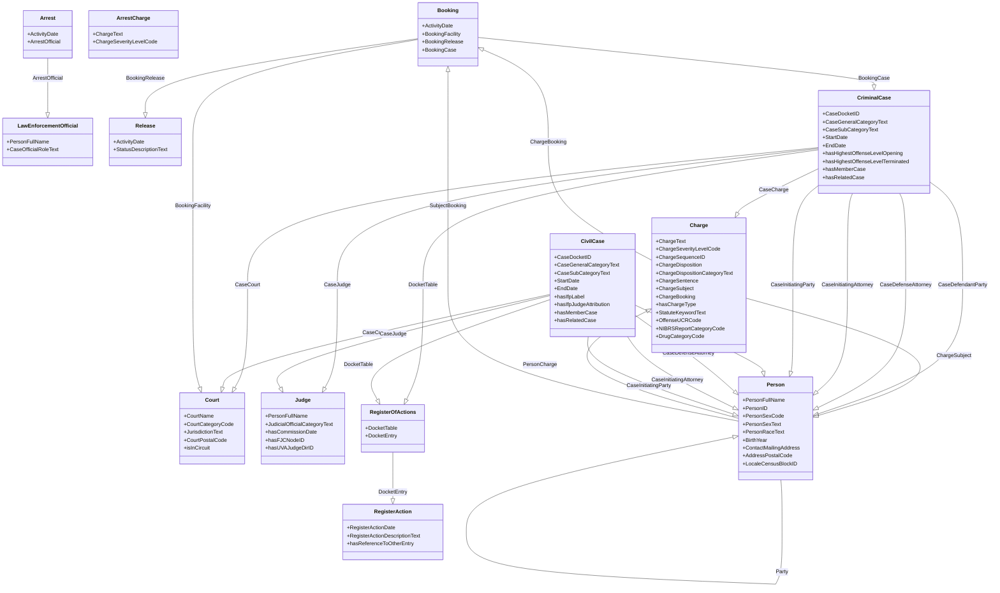

# SCALES Knowledge Graph Exploration

👤 **User**  
@scales

---

🧠 **Assistant**  
I'll help you explore this knowledge graph! Let me start by getting information about what this knowledge graph contains.

Great! I'm now working with **SCALES** (Systematic Content Analysis of Litigation Events), a knowledge graph containing criminal and civil court records across the United States.

SCALES is an integrated justice platform to connect criminal justice data across data silos. The knowledge graph contains over 523 million triples describing 96.5 million entities spanning more than 4.1 million cases, including 2.4 million criminal cases and 1.8 million civil cases. The graph integrates data from federal district courts as well as state and local court systems, linking entities such as parties, attorneys, law firms, judges, charges, sentences, arrests, and bookings across cases. Built on the National Information Exchange Model (NIEM) Justice Domain standard, SCALES employs standardized vocabularies to enable systematic analysis of justice system functioning, reveal inequities, and support evidence-based policy making.

## Key Data Available

**Cases:**
- Criminal Cases (2.4 million)
- Civil Cases (1.8 million)
- Court dockets and register of actions

**People & Entities:**
- Defendants, plaintiffs, and other parties
- Judges (with commission dates, UVA Judge Directory IDs)
- Attorneys (defense and prosecuting)
- Law firms
- Law enforcement officials

**Charges & Sentencing:**
- Charge details (type, severity, descriptions)
- FBI NIBRS and UCR codes
- Charge dispositions (guilty plea, dismissed, etc.)
- Sentences and sentence terms
- Drug-related charge classifications

**Arrests & Bookings:**
- Arrest events with officials
- Booking facilities and release information
- Bond amounts and types

**Geographic & Jurisdiction:**
- Courts (district, circuit, appellate)
- FIPS county codes
- Federal circuits
- Postal codes

## What would you like to explore?

I can help you:
- Query specific cases or case statistics
- Analyze patterns in charges, sentences, or dispositions
- Look at geographic distributions
- Examine attorney or judge participation
- Investigate specific types of crimes or civil matters
- Compare outcomes across different jurisdictions

What aspect of the criminal justice data interests you?

---

👤 **User**  
Visualize the schema

---

🧠 **Assistant**  
I'll create a visual representation of the SCALES knowledge graph schema. Let me generate a Mermaid class diagram showing all the classes and their relationships.

Perfect! I've created a visual schema diagram for the SCALES knowledge graph. The diagram shows:

**Core Case Types:**
- **CriminalCase** and **CivilCase** as the main entities
- Both connect to Court, Judge, and various Person roles (defendants, attorneys, initiating parties)

**Key Relationships:**
- Cases link to **Charges**, which contain details about offenses, severity levels, and FBI codes
- **Person** entities can be defendants, attorneys, or law enforcement officials
- **Booking** events connect cases to detention facilities and releases
- **RegisterOfActions** tracks the chronological docket entries for each case

**Supporting Entities:**
- **Arrest** events with law enforcement officials
- **Court** information with jurisdiction and location data
- **Judge** records with commission dates and identifiers
- **RegisterAction** for individual docket entries

The schema follows the NIEM (National Information Exchange Model) Justice Domain standard, making it interoperable with other justice system databases.

---

👤 **User**  
Create transcript

---

🧠 **Assistant**  
I've created a markdown transcript of our conversation about the SCALES knowledge graph. The transcript includes both prompts and responses, with the Mermaid schema diagram embedded inline as requested.

---

*Created by [mcp-proto-okn](https://github.com/sbl-sdsc/mcp-proto-okn) 0.4.0 for scales on 2024-12-24*

claude-sonnet-4-20250514
