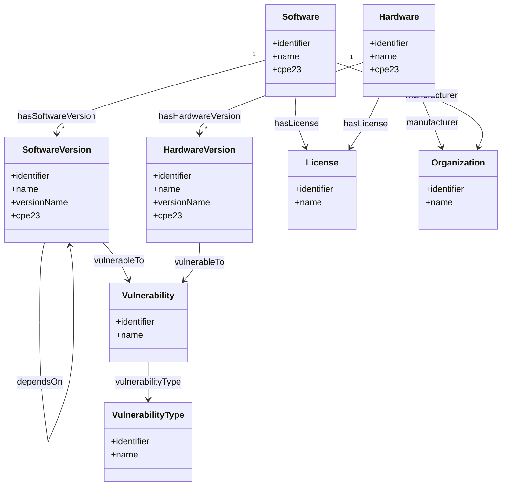

# Chat Transcript: Exploring SecureChain KG

👤 **User**  
@securechainkg

---

🧠 **Assistant**  
I'll help you explore the SecureChainKG knowledge graph. Let me start by getting information about this knowledge graph.

**SecureChain KG Overview**

SecureChain is a comprehensive knowledge graph focused on **software supply chain security**. Here are the key details:

### **Scale & Coverage**
- **9.8 million entities** across 73.5 million triples
- **803,769 software packages** and **8.6 million software versions**
- **259,806 vulnerabilities** mapped to software/hardware
- **53,378 hardware components** with their versions
- Primarily covers **Python (PyPI)** and **Rust (Cargo)** ecosystems

### **Main Entity Types**

1. **Software** - Software applications in the supply chain
2. **Software Version** - Specific versions of software packages
3. **Hardware** - Hardware products in the supply chain
4. **Hardware Version** - Specific hardware versions
5. **Vulnerability** - Security vulnerabilities (CVEs)
6. **Vulnerability Type** - Classifications of vulnerabilities
7. **License** - Software/hardware licenses
8. **Organization** - Manufacturers and organizations

### **Key Relationships**

The knowledge graph tracks critical relationships like:
- **Dependencies** between software versions (`sc:dependsOn`)
- **Vulnerabilities** affecting specific versions (`sc:vulnerableTo`)
- **Licenses** for compliance tracking
- **Hardware-software** connections

### **What You Can Query**

Here are some example questions you could ask:

- "What are the most common vulnerabilities in Python packages?"
- "Show me software packages with the most dependencies"
- "Which hardware components have known vulnerabilities?"
- "What licenses are most commonly used?"
- "Find packages vulnerable to a specific CVE"

Would you like me to run a specific query to explore the data further?

---

👤 **User**  
Visualize the schema

---

🧠 **Assistant**  
Here's the SecureChain KG schema visualization:

### Key Relationships in the Schema:

- **Software/Hardware ↔ Versions**: Each software and hardware product can have multiple versions
- **Dependencies**: Software versions can depend on other software versions (critical for supply chain analysis)
- **Vulnerabilities**: Both software and hardware versions can be vulnerable to specific vulnerabilities
- **Vulnerability Classification**: Vulnerabilities are categorized by type
- **Licensing**: Software and hardware products are associated with licenses
- **Manufacturers**: Hardware and software products are linked to organizations that manufacture them
- **CPE Identifiers**: Common Platform Enumeration identifiers for standardized identification

This schema enables comprehensive tracking of supply chain security, from dependencies and vulnerabilities to licensing compliance!

---

👤 **User**  
Create a transcript

---

*Created by [mcp-proto-okn](https://github.com/sbl-sdsc/mcp-proto-okn) 0.4.0 using claude-sonnet-4-20250514 on 2025-12-21*
