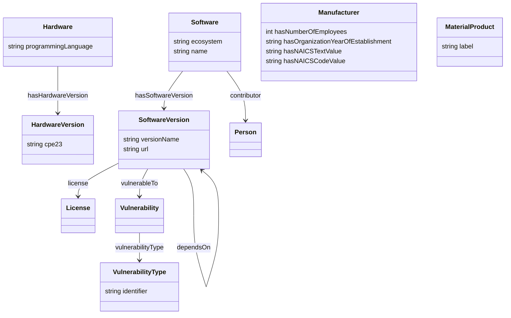

# Chat Transcript: SecureChain KG Exploration

👤 **User**  
@securechainkg

---

🧠 **Assistant**  
I can help you work with the securechainkg knowledge graph. Let me first get the description to understand what this knowledge graph contains.

Great! I can now provide you with information about **SecureChain KG**.

## Overview

**SecureChain KG** is a comprehensive knowledge graph focused on resilient, trustworthy, and secure software supply chains. It's designed to help developers, security analysts, and policymakers understand and strengthen software supply chain security.

## Key Statistics

- **9.8 million entities** including:
  - 803,769 software packages
  - 8.6 million software versions
  - 259,806 vulnerabilities
  - 53,378 hardware components with versions
- **73.5 million triples** (relationships)
- Primarily covers **Python (PyPI: 603K packages)** and **Rust (Cargo: 180K packages)** ecosystems

## What It Does

SecureChain KG maps software components and vulnerabilities across multiple programming languages. It models dependencies between software versions using properties like `sc:dependsOn`, helping to:
- Assess potential security risks
- Identify vulnerabilities in the supply chain
- Ensure license compliance
- Track dependencies across software ecosystems

## Data Sources

The knowledge graph is continuously updated through neural knowledge acquisition pipelines that extract information from:
- Documentation
- CVEs (Common Vulnerabilities and Exposures)
- Bug reports
- Online discussions

Would you like me to:
1. Show you the schema to see what types of entities and relationships are available?
2. Help you construct queries to explore software dependencies or vulnerabilities?
3. Something else specific about software supply chain security?

---

👤 **User**  
Visualize schema

---

🧠 **Assistant**  
Let me follow the workflow to create a schema visualization for SecureChain KG.

Here's the schema visualization for SecureChain KG! The diagram shows the key entities and their relationships:

**Core Software Supply Chain Elements:**
- **Software** → **SoftwareVersion** (via `hasSoftwareVersion`)
- **Hardware** → **HardwareVersion** (via `hasHardwareVersion`)
- **SoftwareVersion** → **Vulnerability** (via `vulnerableTo`)
- **Vulnerability** → **VulnerabilityType** (via `vulnerabilityType`)

**Dependencies and Attribution:**
- **SoftwareVersion** → **SoftwareVersion** (via `dependsOn`) - showing dependency chains
- **Software** → **Person** (via `contributor`)
- **SoftwareVersion** → **License** (via `license`)

**Supply Chain Context:**
- **Manufacturer** and **MaterialProduct** classes for broader supply chain tracking

The diagram emphasizes how software versions are central to tracking dependencies, vulnerabilities, and licensing in the supply chain!

---

*Created by [mcp-proto-okn](https://github.com/sbl-sdsc/mcp-proto-okn) 0.5.0 on 2026-01-17*

Model: claude-sonnet-4-20250514
