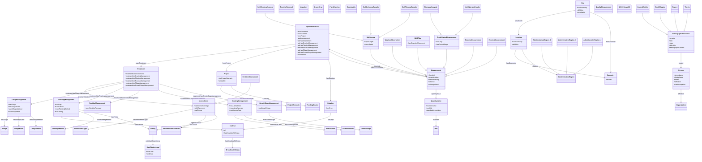

# SOCKG Knowledge Graph Exploration

## Chat Transcript

👤 **User**  
@sockg

---

🧠 **Assistant**  
I'll help you explore this knowledge graph! Let me start by getting information about what this knowledge graph contains.

Perfect! Now I have all the information about the **Soil Organic Carbon Knowledge Graph (SOCKG)**. Let me give you an overview:

## Overview

The Soil Organic Carbon Knowledge Graph (SOCKG) is a comprehensive knowledge graph designed to enhance soil carbon modeling for voluntary carbon markets. It consolidates fragmented agricultural experimental data into a unified semantic framework.

## What's Inside

SOCKG contains detailed agricultural data including:

- **Agricultural Management Practices**: Tillage events, planting methods, crop rotations, fertilizer amendments, grazing management, irrigation, and residue management
- **Soil Measurements**: Chemical, biological, and physical soil samples with depth information
- **Environmental Data**: Weather observations and greenhouse gas flux measurements
- **Crop Information**: Cultivars, growth stages, biomass analysis, yield data
- **Experimental Structure**: Sites, treatments, experimental units, and rotations

## Key Features

The knowledge graph includes **105 classes** and **106 predicates** organized around:

1. **Experimental organization** - Projects, sites, treatments, and experimental units
2. **Management practices** - Detailed tracking of agricultural interventions
3. **Measurements** - Soil samples (chemical/biological/physical), crop measurements, weather, GHG flux
4. **Spatial data** - Geographic locations linked to administrative regions (GADM) and S2 cells
5. **Bibliographic information** - Publications, funding sources, authors

## What Can You Do?

You can query this knowledge graph to:
- Explore soil organic carbon measurements across different management practices
- Analyze the impact of tillage, amendments, and crop rotations on soil carbon
- Investigate relationships between weather patterns and agricultural outcomes
- Find experimental data from specific locations or treatments
- Explore greenhouse gas emissions under different farming practices

Would you like to explore any specific aspect of the data, such as finding sites with certain management practices, analyzing soil carbon trends, or examining specific crops or regions?

---

👤 **User**  
Visualize a detailed schema

---

🧠 **Assistant**  
I'll create a detailed visual schema of the SOCKG knowledge graph using a Mermaid class diagram.

This detailed schema visualization shows the SOCKG structure organized into major sections:

**🔬 Core Experimental Structure** (top): The foundation showing how Projects contain ExperimentalUnits that receive Treatments and generate Measurements

**🌾 Management Practices** (middle-left): All agricultural interventions including tillage, planting, amendments, grazing, and residue management

**📊 Measurements** (middle-right): Various types of measurements including soil samples (chemical, biological, physical), weather observations, GHG flux, and crop-related data

**🗺️ Geographic & Spatial** (lower-left): Location data with administrative regions at multiple levels and spatial geometries

**📚 Bibliographic** (lower-right): Publications, authors, organizations, and funding sources

**⚙️ Supporting Classes** (bottom): Measurement infrastructure like quantity values, units, and timing information

The arrows show key relationships, with solid lines representing associations and dashed lines (--|>) representing inheritance/subclass relationships.

---

👤 **User**  
Create transcript

---

*Created by [mcp-proto-okn](https://github.com/sbl-sdsc/mcp-proto-okn) 0.4.0 using claude-sonnet-4-20250514 on 2025-12-22*
