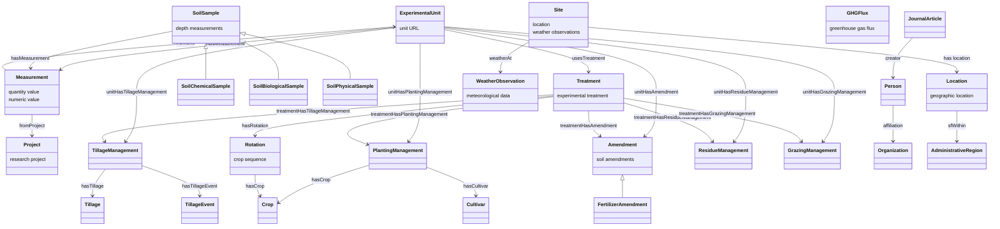

# Chat Transcript: Exploring the Soil Organic Carbon Knowledge Graph

👤 **User**  
@sockg

---

🧠 **Assistant**  
I'll help you explore this knowledge graph! Let me start by getting some information about it.

*[Called get_description() and get_schema() tools]*

Perfect! I now have access to the **Soil Organic Carbon Knowledge Graph (SOCKG)**. This is a comprehensive knowledge graph that integrates agricultural experimental data to support soil carbon modeling and voluntary carbon markets.

## What's in SOCKG?

The knowledge graph contains:

**Core Agricultural Data:**
- **Soil samples** (chemical, biological, and physical properties)
- **Crop management** (planting, tillage, rotation, harvest practices)
- **Amendments** (fertilizers, pesticides, organic matter applications)
- **Environmental data** (weather observations, greenhouse gas flux measurements)
- **Grazing management** (animal species, grazing rates, vegetation)

**Spatial Coverage:**
- Experimental sites across multiple locations
- Linked to administrative regions (countries, states, counties)
- S2 Cell geospatial indexing

**Research Context:**
- Publications (journal articles, reports, theses)
- Projects and experimental scenarios
- Treatment descriptions and experimental units

## How can I help you?

I can help you:
1. **Explore the data** - Find specific measurements, sites, or experiments
2. **Analyze relationships** - Understand how management practices affect soil carbon
3. **Query specific topics** - Tillage effects, crop rotations, amendment impacts
4. **Visualize the schema** - See how different concepts relate to each other
5. **Generate reports** - Summarize findings or create data exports

What would you like to explore in the Soil Organic Carbon Knowledge Graph?

---

👤 **User**  
Visualize the schema

---

🧠 **Assistant**  
I'll create a visualization of the SOCKG schema for you.

*[Generated and cleaned Mermaid class diagram]*

Perfect! Here's the SOCKG schema visualization:

## Key Schema Components:

**Core Experimental Structure:**
- **ExperimentalUnit** - The fundamental unit of experimentation, connected to treatments and measurements
- **Treatment** - Experimental treatments linking to various management practices
- **Site** & **Location** - Geographic context for experiments

**Agricultural Management:**
- **TillageManagement** - Soil manipulation practices
- **PlantingManagement** - Crop planting and cultivation details
- **ResidueManagement** - Post-harvest residue handling
- **GrazingManagement** - Animal grazing activities
- **Amendment** - Soil amendments including fertilizers

**Data & Measurements:**
- **Measurement** - Quantitative observations linked to experimental units and projects
- **SoilSample** - Three specialized types (Chemical, Biological, Physical)
- **WeatherObservation** - Meteorological data
- **GHGFlux** - Greenhouse gas measurements

**Research Context:**
- **Project** - Research initiatives
- **JournalArticle**, **Person**, **Organization** - Publication and attribution metadata

This structure allows comprehensive tracking of agricultural experiments and their impacts on soil organic carbon!

---

👤 **User**  
Create transcript

---

🧠 **Assistant**  
*[Creating this transcript document]*

---

*Created by [mcp-proto-okn](https://github.com/sbl-sdsc/mcp-proto-okn) 0.4.0 using claude-sonnet-4-20250514 on 2025-12-22*
