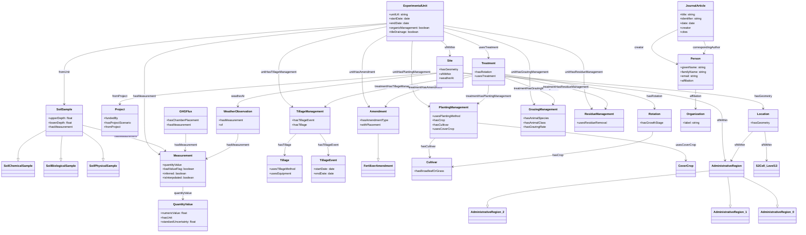

## Chat Transcript
Exploring the Soil Organic Carbon Knowledge Graph (SOCKG)

👤 **User**  
@sockg

---

🧠 **Assistant**  
I'll help you explore the sockg knowledge graph. Let me start by getting information about this knowledge graph and its schema.

Great! I can now help you explore the **Soil Organic Carbon Knowledge Graph (SOCKG)**. This knowledge graph contains detailed agricultural experimental data focused on soil organic carbon, which is crucial for understanding carbon sequestration and climate-friendly farming practices.

## What's in SOCKG?

The knowledge graph includes:

- **Agricultural experiments**: Tillage events, crop rotations, fertilizer applications, soil measurements
- **Environmental data**: Weather observations, greenhouse gas flux measurements
- **Management practices**: Planting, grazing, irrigation, residue management
- **Soil samples**: Chemical, biological, and physical analyses of soil
- **Geographic coverage**: Sites across multiple locations with spatial data
- **Publications**: Research papers, reports, and bibliographic information

## Key Classes (105 total)

The schema includes classes for:
- Experimental units, treatments, and sites
- Soil samples (chemical, biological, physical)
- Agricultural management (tillage, planting, grazing, irrigation)
- Crops, cultivars, and cover crops
- Measurements (biomass, GHG flux, erosion, water quality)
- Weather observations
- Publications and research projects

## What would you like to explore?

I can help you:
- Find specific data about soil organic carbon measurements
- Explore relationships between management practices and outcomes
- Query experimental treatments and their effects
- Analyze spatial patterns across different sites
- Search for publications and research projects
- Examine specific crops, tillage methods, or amendments

What aspect of soil carbon research interests you?

---

👤 **User**  
Visualize the schema

---

🧠 **Assistant**  

Here's a visualization of the SOCKG schema showing the main classes and their relationships!

## Key Components:

**Core Experimental Structure:**
- **ExperimentalUnit** - The central entity containing treatments, measurements, and management practices
- **Treatment** - Experimental treatments applied to units
- **Site** - Physical locations where experiments are conducted

**Management Practices:**
- **TillageManagement** - Soil cultivation practices
- **PlantingManagement** - Crop planting details
- **GrazingManagement** - Livestock grazing activities
- **ResidueManagement** - Crop residue handling
- **Amendment** - Fertilizers and other soil amendments

**Data Collection:**
- **SoilSample** - Subdivided into chemical, biological, and physical samples
- **Measurement** - Quantitative observations with units
- **WeatherObservation** - Meteorological data
- **GHGFlux** - Greenhouse gas emissions

**Geographic Context:**
- **Location** - Spatial coordinates
- **AdministrativeRegion** - Countries, states, counties
- **S2Cell** - Geometric grid cells

**Publications:**
- **JournalArticle** - Research papers
- **Person** - Authors and researchers
- **Organization** - Affiliated institutions

The diagram shows how experimental units connect to sites, treatments, and various measurements, creating a comprehensive framework for tracking soil carbon research data!

---

*Created by [mcp-proto-okn](https://github.com/sbl-sdsc/mcp-proto-okn) 0.4.0 for sockg on 2025-12-24*

claude-sonnet-4-20250514
