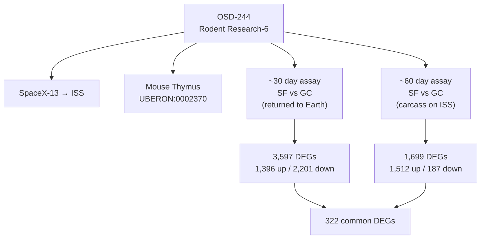

# Spaceflight Thymus Transcriptomics Analysis — OSD-244

## Chat Transcript: Multi-KG Analysis of NASA Rodent Research-6

---

👤 **User**
Get information about the space flight study OSD-244

---

🧠 **Assistant**

The study **OSD-244** ("Rodent Research-6") is a spaceflight transcriptomics experiment from NASA's Open Science Data Repository, stored in the **SPOKE-GeneLab** knowledge graph.

### Study metadata

| Field | Value |
|---|---|
| **Study** | OSD-244 — Rodent Research-6 |
| **Mission** | SpaceX-13 → ISS, NASA program |
| **Dates** | December 15, 2017 – January 13, 2018 |
| **Assay** | RNA-Seq transcription profiling (Illumina NovaSeq 6000, DESeq2) |
| **Tissue** | Mouse thymus (UBERON:0002370) |
| **Organism** | *Mus musculus* |

The study contains **30 distinct assay comparisons**. Key matched Space Flight (SF) vs. Ground Control (GC) comparisons were identified at two time points:

- **~30 day assay** (ID: `...57da8b7ca3c3b4af08d72a00029a2c70`): Mice returned to Earth, euthanized on ground. SF group: ~30 day, On Earth, Space Flight, Upon euthanasia. GC group: ~30 day, Ground Control, On Earth, Upon euthanasia.
- **~60 day assay** (ID: `...0a77ea7b391ab5c3c3546c1af0c3e2c8`): Flight mice collected as carcasses on ISS. SF group: ~60 day, Carcass, On ISS, Space Flight. GC group: ~60 day, Carcass, Ground Control, On Earth.

---

👤 **User**
Get the differentially expressed genes for the ~30 day and ~60 day time points

---

🧠 **Assistant**

### ~30 day differential expression (SF vs GC, adj p < 0.05)

3,597 significant DEGs were identified: 1,396 upregulated, 2,201 downregulated — skewed toward downregulation.

**Top upregulated genes:**

| Gene | log2FC | Description |
|------|--------|-------------|
| Trav7d-2 | +20.53 | T cell receptor alpha variable |
| Sftpc | +9.37 | Surfactant protein C |
| Cldn18 | +6.77 | Claudin 18 |
| Sftpb | +6.77 | Surfactant protein B |
| Cxcl15 | +6.35 | Chemokine (C-X-C motif) ligand 15 |
| Slc34a2 | +5.13 | Solute carrier family 34 member 2 |
| Dbh | +4.99 | Dopamine beta-hydroxylase |
| Ly6g6c | +4.34 | Lymphocyte antigen 6 G6C |

**Top downregulated genes:**

| Gene | log2FC | Description |
|------|--------|-------------|
| Cnfn | −15.76 | Cornifelin |
| Cldn34c6 | −6.64 | Claudin 34C6 |
| Gpr101 | −6.54 | G protein-coupled receptor 101 |
| Vmn1r28 | −6.27 | Vomeronasal 1 receptor 28 |

### ~60 day differential expression (SF vs GC, adj p < 0.05)

1,699 significant DEGs: 1,512 upregulated, 187 downregulated — 89% upregulated, opposite skew from 30d.

**Top upregulated genes:**

| Gene | log2FC | Description |
|------|--------|-------------|
| Krt4 | +9.43 | Keratin 4 |
| Myh8 | +8.66 | Myosin heavy chain 8 |
| Krt13 | +8.25 | Keratin 13 |
| Klk11 | +6.74 | Kallikrein 11 |
| Bpifa1 | +6.32 | BPI fold containing A1 |

**Top downregulated genes (musculoskeletal deconditioning signature):**

| Gene | log2FC | Description |
|------|--------|-------------|
| Ibsp | −7.21 | Bone sialoprotein |
| Tnn | −3.13 | Tenascin N |
| Bglap | −2.83 | Osteocalcin |
| Tnni1 | −2.60 | Troponin I, slow |

---

👤 **User**
Find the common differentially expressed genes for the ~30 day and ~60 duration time points

---

🧠 **Assistant**

**322 genes** were significantly differentially expressed (adj p < 0.05) at both the ~30 day and ~60 day time points. The vast majority are concordant (same direction at both time points), with only 5 discordant genes.

| Category | Count |
|---|---|
| Total common DEGs | 322 |
| Concordant upregulated | ~247 |
| Concordant downregulated | ~70 |
| Discordant | 5 |

#### Top concordantly upregulated (persistent spaceflight signature)

| Gene | 30d log2FC | 60d log2FC | Function |
|------|-----------|-----------|----------|
| Agt | +3.85 | +4.44 | Angiotensinogen |
| Ly6g6c | +4.34 | +4.58 | Lymphocyte antigen 6 G6C |
| Alox15 | +3.00 | +3.83 | Arachidonate 15-lipoxygenase |
| F10 | +3.50 | +3.81 | Coagulation factor X |
| F7 | +3.37 | +3.40 | Coagulation factor VII |
| Ahsg | +3.19 | +3.55 | Alpha-2-HS-glycoprotein |
| Hamp | +3.17 | +2.85 | Hepcidin |
| C4b | +2.72 | +3.02 | Complement C4B |
| Thbs1 | +3.02 | +2.32 | Thrombospondin 1 |
| F5 | +2.86 | +3.01 | Coagulation factor V |

#### Top concordantly downregulated

| Gene | 30d log2FC | 60d log2FC | Function |
|------|-----------|-----------|----------|
| Gm24871 | −2.10 | −1.97 | Predicted gene 24871 |
| Rnu12 | −1.89 | −1.61 | RNA U12, small nuclear |
| Itm2a | −1.88 | −1.16 | Integral membrane protein 2A |
| Nebl | −1.72 | −1.23 | Nebulette |
| Trbv23 | −1.67 | −1.47 | TCR beta variable V23 |
| Lpar6 | −1.47 | −1.05 | Lysophosphatidic acid receptor 6 |
| Ccne2 | −1.27 | −1.11 | Cyclin E2 |
| Hmgb1 | −0.76 | −0.77 | High mobility group box 1 |
| Kcnh7 | −2.55 | −3.25 | Potassium channel H7 |

#### 5 Discordant genes (down at 30d, up at 60d)

| Gene | 30d log2FC | 60d log2FC |
|------|-----------|-----------|
| Gm39079 | −4.36 | +3.70 |
| Tmem45a2 | −4.01 | +3.05 |
| Albfm1 | −4.01 | +3.44 |
| Gm10319 | −3.23 | +2.95 |
| Mgam | −1.33 | +1.37 |

---

👤 **User**
Create a concordance plot 30 vs. 60 days

---

🧠 **Assistant**

A concordance scatter plot was generated using all 1,103 genes measured at both time points, with log2 fold change at ~30 days on the x-axis and ~60 days on the y-axis. The plot uses Chart.js and includes:

- **Purple points**: 322 concordant DEGs (significant at both time points, same direction)
- **Orange points**: 5 discordant genes (significant at both, opposite direction)
- **Gray points**: genes not significant at both time points
- Dashed diagonal line showing perfect concordance
- Gene labels for key functional genes (coagulation factors, complement, inflammatory mediators)
- Quadrant annotations

---

👤 **User**
Map the common differentially expressed genes to the human orthologs

---

🧠 **Assistant**

Using the `IS_ORTHOLOG_MGiG` predicate in SPOKE-GeneLab, **330 mouse-to-human ortholog mappings** were retrieved for the 322 common DEGs. Key one-to-many mappings include:

- H2-D1 → HLA-A, HLA-B, HLA-C, HLA-E, HLA-F, HLA-G (6 human orthologs)
- Saa3 → SAA1, SAA2, SAA3P
- Pira* → LILRA1–6, LILRB3, LILRB5 (7 human orthologs)
- Ifitm3 → IFITM1, IFITM2, IFITM3
- Apol9b → APOL1, APOL2, APOL3, APOL4

### Human ortholog functional categories

#### Coagulation and hemostasis (all UP)

| Mouse | Human | 30d log2FC | 60d log2FC |
|-------|-------|-----------|-----------|
| Agt | AGT | +3.85 | +4.44 |
| F7 | F7 | +3.37 | +3.40 |
| F10 | F10 | +3.50 | +3.81 |
| F5 | F5 | +2.86 | +3.01 |
| Thbs1 | THBS1 | +3.02 | +2.32 |
| Selp | SELP | +1.95 | +2.33 |
| Plaur | PLAUR | +1.66 | +2.09 |
| Serping1 | SERPING1 | +1.93 | +1.97 |

#### Complement and innate immunity (all UP)

| Mouse | Human | 30d log2FC | 60d log2FC |
|-------|-------|-----------|-----------|
| C4b | C4A, C4B | +2.72 | +3.02 |
| C2 | C2 | +2.17 | +1.68 |
| C1ra | C1R | +1.81 | +1.89 |
| Cfp | CFP | +1.38 | +1.14 |
| C5ar1 | C5AR1 | +1.95 | +2.22 |
| Fcna | FCN1, FCN2 | +1.61 | +1.47 |
| Clec4d | CLEC4D | +2.16 | +2.41 |
| Lbp | LBP | +1.86 | +1.76 |

#### Inflammation, cytokines, and pattern recognition (all UP)

| Mouse | Human | 30d log2FC | 60d log2FC |
|-------|-------|-----------|-----------|
| Saa3 | SAA1, SAA2 | +2.27 | +3.19 |
| Il6ra | IL6R | +1.23 | +1.28 |
| Tnfrsf1b | TNFRSF1B | +0.97 | +1.16 |
| Cd14 | CD14 | +2.02 | +2.25 |
| Tlr5 | TLR5 | +1.63 | +1.67 |
| Nod1 | NOD1 | +1.28 | +1.12 |
| Nod2 | NOD2 | +0.79 | +0.97 |
| Irak2 | IRAK2 | +1.25 | +1.22 |
| Serpina3n | SERPINA3 | +1.80 | +2.60 |
| Hamp | HAMP | +3.17 | +2.85 |
| Unc93b1 | UNC93B1 | +1.29 | +1.50 |

#### Arachidonate and eicosanoid metabolism (all UP)

| Mouse | Human | 30d log2FC | 60d log2FC |
|-------|-------|-----------|-----------|
| Alox15 | ALOX15 | +3.00 | +3.83 |
| Alox5 | ALOX5 | +2.08 | +1.55 |
| Alox5ap | ALOX5AP | +1.82 | +1.12 |
| Ltc4s | LTC4S | +2.62 | +2.45 |
| Ptgs1 | PTGS1 | +1.30 | +1.10 |
| Ptges | PTGES | +1.60 | +1.56 |
| Ptgir | PTGIR | +1.14 | +1.04 |
| Cyp4f18 | CYP4F3 | +2.09 | +1.94 |

#### MHC class I (UP except MR1 down)

| Mouse | Human | 30d log2FC | 60d log2FC |
|-------|-------|-----------|-----------|
| H2-D1 | HLA-A/B/C/E/F/G | +1.17 | +1.07 |
| H2-K1 | HLA-A/B/C/E/F/G | +0.94 | +1.03 |
| Mr1 | MR1 | −1.06 | −0.77 |

#### ECM, vascular, and structural (all UP)

| Mouse | Human | 30d log2FC | 60d log2FC |
|-------|-------|-----------|-----------|
| Fn1 | FN1 | +2.31 | +2.66 |
| Col6a1 | COL6A1 | +1.55 | +1.77 |
| Col6a3 | COL6A3 | +1.53 | +1.50 |
| Eln | ELN | +1.55 | +2.00 |
| Vim | VIM | +1.58 | +1.44 |
| Loxl2 | LOXL2 | +1.74 | +1.66 |
| Cldn5 | CLDN5 | +2.72 | +2.46 |
| Robo4 | ROBO4 | +1.85 | +1.80 |
| Plvap | PLVAP | +2.25 | +2.02 |
| Pdgfrb | PDGFRB | +1.60 | +1.31 |
| Fgfr1 | FGFR1 | +1.67 | +1.51 |

#### Persistently downregulated

| Mouse | Human | 30d log2FC | 60d log2FC |
|-------|-------|-----------|-----------|
| Ccne2 | CCNE2 | −1.27 | −1.11 |
| Hmgb1 | HMGB1 | −0.76 | −0.77 |
| Nebl | NEBL | −1.72 | −1.23 |
| Itm2a | ITM2A | −1.88 | −1.16 |
| Lpar6 | LPAR6 | −1.47 | −1.05 |
| Atg12 | ATG12 | −0.78 | −0.45 |
| Kcnh7 | KCNH7 | −2.55 | −3.25 |
| Slc40a1 | SLC40A1 | −0.82 | −0.71 |
| Lipa | LIPA | −0.78 | −0.55 |
| Ostm1 | OSTM1 | −0.84 | −0.65 |

---

👤 **User**
Which diseases are associated with these genes? Use all available resources with disease information. Keep track of the source for these disease associations.

---

🧠 **Assistant**

Disease associations were queried from four independent sources:

1. **SPOKE-OKN** (proto-okn SPARQL) — `ASSOCIATES_DaG`, `EXPRESSEDIN_GeiD`, `MARKER_POS_GmpD`, `MARKER_NEG_GmnD` predicates
2. **Open Targets Platform** (GraphQL API) — scored target-disease evidence (0–1 scale)
3. **ProKN** (proto-okn SPARQL) — UniProt curated protein-disease annotations with OMIM cross-references
4. **PubMed** — spaceflight-specific literature

### Cardiovascular and thrombotic disease

| Disease | Genes | Sources |
|---------|-------|---------|
| Hypertension | AGT↑, SELP↑, FN1↑, APOE↑ | SPOKE-OKN, Open Targets (0.65), ProKN |
| Venous thromboembolism / DVT | F10↑, F5↑, SELP↑ | Open Targets (0.73) |
| Stroke / cerebrovascular disease | AGT↑, SELP↑, APOE↑, F5↑, F10↑ | SPOKE-OKN, Open Targets (0.67) |
| Coronary artery disease | APOE↑, AGT↑, FN1↑, SELP↑ | SPOKE-OKN, Open Targets (0.82) |
| Atrial fibrillation | AGT↑, F10↑, SELP↑ | Open Targets (0.42) |
| Thrombophilia / activated protein C resistance | F5↑, SELP↑ | Open Targets (0.80), ProKN |
| Budd-Chiari syndrome (hepatic vein thrombosis) | F5↑ | ProKN-unique |
| Recurrent pregnancy loss | F5↑ | ProKN-unique |
| Sickle cell disease | SELP↑ | Open Targets (0.56) |
| Cardiomyopathy | AGT↑, HAMP↑ | SPOKE-OKN |

### Metabolic and endocrine disease

| Disease | Genes | Sources |
|---------|-------|---------|
| Diabetes mellitus (type 2) | AGT↑, APOE↑, FN1↑, HAMP↑, THBS1↑ | SPOKE-OKN, Open Targets (0.37) |
| Familial hypercholesterolemia | APOE↑, LDLR↑ | SPOKE-OKN, Open Targets (0.63), ProKN |
| Cholesterol ester storage disease / Wolman disease | LIPA↓ | ProKN-unique |

### Iron metabolism and hematologic disease

| Disease | Genes | Sources |
|---------|-------|---------|
| Hemochromatosis type 2B | HAMP↑ | SPOKE-OKN, Open Targets (0.80), ProKN |
| Hemochromatosis type 4 | SLC40A1↓ | ProKN-unique |
| Iron deficiency anemia / thalassemia | HAMP↑, SLC40A1↓ | SPOKE-OKN |

### Immune, inflammatory, and allergic disease

| Disease | Genes | Sources |
|---------|-------|---------|
| Asthma | ALOX5↑, ALOX15↑ | SPOKE-OKN, Open Targets (0.30) |
| Hereditary angioedema (types I & II) | SERPING1↑ | SPOKE-OKN, Open Targets (0.82), ProKN |
| Inflammatory bowel disease | F5↑ | SPOKE-OKN |

### Neurodegenerative disease

| Disease | Genes | Sources |
|---------|-------|---------|
| Alzheimer's disease | APOE↑, SERPINA3↑ | SPOKE-OKN, Open Targets (0.68), ProKN |
| Parkinson's disease | APOE↑ | SPOKE-OKN |
| Age-related macular degeneration | APOE↑ | Open Targets (0.63) |

### Renal disease

| Disease | Genes | Sources |
|---------|-------|---------|
| Chronic kidney disease | AGT↑, FN1↑, HAMP↑ | SPOKE-OKN |
| Renal tubular dysgenesis | AGT↑ | Open Targets (0.74), ProKN |
| Glomerulopathy with fibronectin deposits | FN1↑ | Open Targets (0.75), ProKN |

### Structural / connective tissue (ProKN-unique)

| Disease | Genes | Sources |
|---------|-------|---------|
| Supravalvular aortic stenosis | ELN↑ | ProKN |
| Cutis laxa, autosomal dominant 1 | ELN↑ | ProKN |
| Bethlem myopathy 1 | COL6A1↑ | ProKN |
| Ullrich congenital muscular dystrophy | COL6A1↑ | ProKN |
| Pfeiffer syndrome + 5 other craniosynostoses | FGFR1↑ | ProKN |
| Myeloproliferative disorder + 4 others | PDGFRB↑ | ProKN |

### Cancer (expression and prognostic markers from SPOKE-OKN)

| Cancer type | Genes expressed / markers | Association type |
|-------------|--------------------------|-----------------|
| Liver cancer | AGT, F5, F7, F10, HAMP, SERPINA3, SERPING1, APOE | Expressed in |
| Kidney cancer (unfavorable) | FN1, THBS1, ALOX5, ALOX5AP, PTGS1, VIM, C5AR1, SERPING1, CD14, F10 | Unfavorable prognostic marker |
| Stomach cancer (unfavorable) | FN1, THBS1, F5 | Unfavorable prognostic marker |
| Lung cancer | FN1↑, CCNE2↓ | Genetic assoc + CCNE2 unfavorable marker |
| Ovarian cancer | PTGS1, SERPING1, C5AR1, ALOX5AP | Expressed in + prognostic markers |

### Spaceflight-relevant literature (PubMed)

- Wu et al. (2024) *Nat Commun* [DOI: 10.1038/s41467-023-42013-y](https://doi.org/10.1038/s41467-023-42013-y): Single-cell analysis of immune dysfunction in simulated microgravity and spaceflight — identified interferon signaling, pyroptosis, IL-6 signaling, and impaired T/NK cell function.
- da Silveira et al. (2020) *Cell* [DOI: 10.1016/j.cell.2020.11.002](https://doi.org/10.1016/j.cell.2020.11.002): Comprehensive multi-omics analysis — mitochondrial stress as central biological hub for spaceflight, with enrichment for innate immunity, chronic inflammation, circadian rhythm.

---

## Summary

This analysis integrated data from **NASA's GeneLab (OSD-244)** through the **SPOKE-GeneLab** knowledge graph, mapped mouse genes to human orthologs, and queried disease associations across **four independent sources**: SPOKE-OKN, Open Targets, ProKN, and PubMed.

The persistent spaceflight transcriptional signature in mouse thymus — dominated by upregulation of coagulation (F5, F7, F10), complement (C4A/B, C2, C1R, C5AR1), inflammation (SAA1/2, CD14, TLR5, NOD1/2), and eicosanoid (ALOX5/15, LTC4S, PTGS1) pathways — maps to human disease risks concentrated in:

1. **Thrombotic/cardiovascular disease** (venous thromboembolism, stroke, coronary artery disease)
2. **Iron dysregulation** (hemochromatosis, anemia of inflammation/"space anemia")
3. **Chronic inflammation** (asthma, hereditary angioedema, IBD)
4. **Neurodegeneration** (Alzheimer's disease via APOE, SERPINA3)
5. **Structural/connective tissue disorders** (aortic stenosis, muscular dystrophy, craniosynostoses)

These findings converge on conditions already recognized as spaceflight health risks and identify potential countermeasure targets, particularly in the eicosanoid pathway where existing drugs (NSAIDs, leukotriene antagonists, 5-LOX inhibitors) could be explored.

---

### Knowledge graphs and tools used

| Resource | Type | Role |
|----------|------|------|
| spoke-genelab | Proto-OKN KG (SPARQL) | Spaceflight DEG data, ortholog mapping |
| spoke-okn | Proto-OKN KG (SPARQL) | Disease-gene associations, cancer markers |
| prokn | Proto-OKN KG (SPARQL) | UniProt/OMIM Mendelian disease annotations |
| Open Targets Platform | GraphQL API | Scored target-disease evidence |
| PubMed | MCP Literature search | Spaceflight immune/omics publications |

---

*Created by [mcp-proto-okn](https://github.com/sbl-sdsc/mcp-proto-okn) 0.6.0 on 2026-03-18*

*Model: claude-opus-4-6*
