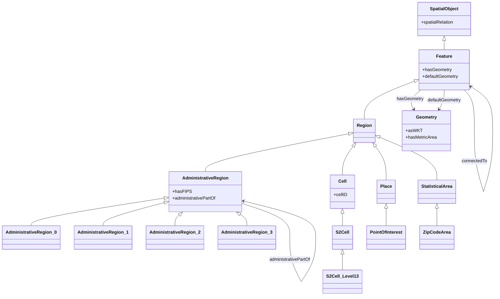

## Chat Transcript
Exploring the SAWGraph Spatial Knowledge Graph

👤 **User**  
@spatialkg

---

🧠 **Assistant**  
I'll help you explore the spatialkg knowledge graph. Let me first get information about this knowledge graph to understand what data it contains.

*[Called spatialkg-dev:get_description]*

Great! Now let me get the schema to show you what kinds of data and relationships are available in this knowledge graph.

*[Called spatialkg-dev:get_schema with compact=true]*

# SAWGraph Spatial KG

Welcome! This is the **SAWGraph Spatial Knowledge Graph**, a large-scale geospatial knowledge graph covering the 48 contiguous United States. It contains 756.9 million triples describing 16.8 million spatial entities.

## What's in this knowledge graph?

The knowledge graph contains:

- **7.4 million S2 cells** at Level 13 (~1.27 km² each) - a hierarchical grid system covering the entire area
- **Administrative regions** at three levels:
  - Level 1: 102 states
  - Level 2: 6,228 counties  
  - Level 3: 35,458 county subdivisions (towns, townships, etc.)

All these spatial entities are connected through various spatial relationships, making it possible to query geographic relationships, find nearby areas, understand administrative hierarchies, and more.

## What can you do with it?

Here are some example queries you could run:

- Find all counties in a particular state
- Get S2 cells connected to a specific administrative region
- Explore spatial relationships (contains, touches, intersects, etc.)
- Look up regions by FIPS codes
- Find administrative hierarchies

Would you like me to:
1. Run a sample query to show you how the data looks?
2. Help you find specific geographic information?
3. Visualize the schema in a diagram?
4. Something else?

What would you like to explore?

---

👤 **User**  
Visualize the schema

---

🧠 **Assistant**  
Let me create a visual schema diagram for you.

*[Called bash_tool to create initial Mermaid diagram draft]*
*[Called spatialkg-dev:clean_mermaid_diagram to clean the diagram]*
*[Created file at /mnt/user-data/outputs/spatialkg-schema.mermaid]*
*[Called present_files to share the diagram]*

Here's the schema visualization for the SAWGraph Spatial Knowledge Graph:

The diagram shows the hierarchical structure of the knowledge graph, with key spatial relationships between features including containment, intersection, touching, and administrative hierarchies.

---

*Created by [mcp-proto-okn](https://github.com/sbl-sdsc/mcp-proto-okn) 0.4.0 for spatialkg on 2025-12-24*

claude-sonnet-4-20250514
