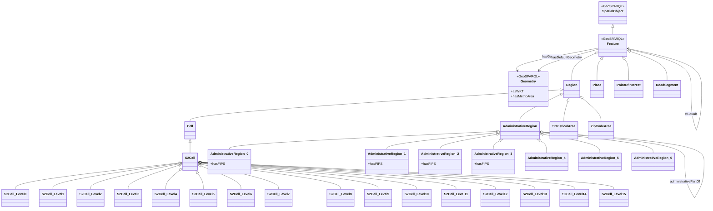

# Chat Transcript: SAWGraph Spatial Knowledge Graph Exploration

👤 **User**  
@spatialkg

---

🧠 **Assistant**  
I'll help you explore the spatial knowledge graph! Let me first get some information about this knowledge graph.

*[Called get_description() and get_schema() tools]*

Great! I now have information about the **SAWGraph Spatial Knowledge Graph**. This is a comprehensive geospatial knowledge graph covering the 48 contiguous U.S. states. Here's what you can explore:

## Overview
The SAWGraph Spatial KG contains **756.9 million triples** describing **16.8 million spatial entities**, including:
- **7.4 million S2 cells** at Level 13 (approximately 1.27 km² each)
- **Administrative regions** across 3 hierarchical levels:
  - Level 1: 102 states
  - Level 2: 6,228 counties
  - Level 3: 35,458 county subdivisions (towns, townships, etc.)

## Key Features
- Uses the **S2 discrete global grid system** for spatial discretization
- Implements **OGC GeoSPARQL** standards
- Contains detailed spatial relationships (intersects, contains, touches, etc.)
- Provides WKT geometries for spatial analysis

## Example Queries You Can Run

**1. Find administrative regions:**
- List states, counties, or county subdivisions
- Find regions by name or FIPS code

**2. Explore S2 cells:**
- Query cells at different zoom levels
- Find cells connected to specific regions

**3. Spatial relationships:**
- Find regions that intersect, contain, or touch each other
- Discover spatial connections between different areas

**4. Geographic analysis:**
- Calculate areas of regions
- Find neighboring counties or subdivisions

Would you like me to run a specific query? For example, I could:
- Show you counties in a specific state
- Find S2 cells in a particular area
- Demonstrate spatial relationships between regions
- Explore the structure of a specific geographic area

What would you like to explore?

---

👤 **User**  
Visualize the schema

---

🧠 **Assistant**  
*[Called visualize_schema() and clean_mermaid_diagram() tools]*

Here's the schema visualization for the SAWGraph Spatial Knowledge Graph:

## Key Schema Components:

**Class Hierarchy:**
- **SpatialObject** (GeoSPARQL) → **Feature** → branches into Regions, Places, and Points of Interest
- **S2Cell hierarchy** with 16 zoom levels (0-15), where Level 13 is most prevalent in the data
- **AdministrativeRegion hierarchy** with 7 levels (0-6), focusing on Level 1 (states), Level 2 (counties), and Level 3 (subdivisions)

**Spatial Relationships:**
- Standard GeoSPARQL predicates: sfContains, sfWithin, sfIntersects, sfTouches, sfCrosses, sfOverlaps, sfDisjoint, sfEquals
- Custom predicates: connectedTo, spatiallyRelatedTo, administrativePartOf

**Key Properties:**
- Geometries with WKT serialization and metric area calculations
- FIPS codes for administrative regions
- Cell identifiers for S2 cells

This schema enables rich spatial queries across different geographic representations and hierarchies!

---

👤 **User**  
Create a transcript

---

*Created by [mcp-proto-okn](https://github.com/sbl-sdsc/mcp-proto-okn) 0.4.0 using claude-sonnet-4-20250514 on 2025-12-22*
