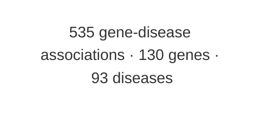

# OSD-244 Spaceflight Gene Analysis: Mouse Thymus → Human Disease & Literature

A multi-step bioinformatics session using the Proto-OKN knowledge graphs (`spoke-genelab`, `spoke-okn`) and PubMed to investigate NASA's OSD-244 (Rodent Research-6) spaceflight study. The analysis covers differential expression, mouse-to-human ortholog mapping, disease association lookup, and spaceflight literature retrieval.

---

## Session overview

| Step | Action | Tool / Graph |
|---|---|---|
| 1 | Identify spaceflight↔ground assays in OSD-244, extract DE genes at 30-day and 60-day timepoints | `spoke-genelab` |
| 2 | Find genes concordantly DE at both timepoints (322 overlap genes) | local analysis |
| 3 | Map mouse genes to human orthologs via `IS_ORTHOLOG_MGiG` | `spoke-genelab` |
| 4 | Look up human gene → disease associations via `ASSOCIATES_DaG` | `spoke-okn` |
| 5 | Find spaceflight/microgravity literature for the gene clusters | PubMed |

---

## 👤 User

> @spoke-genelab: Map the mouse genes to the human orthologs

## 🧠 Assistant

I queried the `IS_ORTHOLOG_MGiG` predicate in `spoke-genelab` to map our 322 common DE mouse genes (those significantly DE at both ~30-day and ~60-day timepoints in OSD-244 thymus) to their human orthologs.

**Key technical fix needed:** the `taxonomy` property values are URIs (`obo:NCBITaxon_10090` for mouse, `obo:NCBITaxon_9606` for human), not bare string literals. With that fix, the orthology table contains 22,899 mouse→human ortholog edges total.

### Mapping summary

| | Count | % of 322 |
|---|---:|---:|
| Mouse genes mapped to ≥1 human ortholog | **295** | **91.6%** |
| One-to-one mappings | 280 | 87.0% |
| One-to-many mappings (gene families) | 15 | 4.7% |
| No human ortholog in the graph | 27 | 8.4% |

### Key labeled genes — mouse → human

**Concordant up (top 15)** — all 15 map cleanly:

`Ly6g6c→LY6G6C`, `Sim2→SIM2`, `Agt→AGT`, `Ceacam19→CEACAM19`, `F10→F10`, `Hmga1b→HMGA1`, `Clca1→CLCA1`, `Alox15→ALOX15`, `F7→F7`, `Ahsg→AHSG`, `Prkag3→PRKAG3`, `Gsc→GSC`, `Hamp→HAMP`, `Asb5→ASB5`, `F5→F5`

The coagulation cluster (`F5`, `F7`, `F10`), iron/inflammation axis (`Hamp`, `Agt`, `Ahsg`), and lipid-metabolism (`Alox15`) signal all carry through to identical human symbols.

**Concordant down (top 15)** — only 5 of 15 map to protein-coding human orthologs:

`Kcnh7→KCNH7`, `Itm2a→ITM2A`, `Nebl→NEBL`, plus `Rnu12→RNU12` and two `Gm…` MGI IDs that turn out to be small nuclear/nucleolar RNAs (`Gm24871→RNU5E-1`, `Gm25313→RNU5B-1`). The remaining 10 are mouse-specific predicted/Riken/T-cell-receptor genes with no human ortholog. The most interesting hit here is **`Itm2a→ITM2A`**, a classic thymocyte-developmental marker.

**Discordant (5)** — only 2 of 5 map: `Mgam→MGAM` and `Tmem45a2→TMEM45A`. The other three (`Gm39079`, `Gm10319`, `Albfm1`) are mouse-specific loci.

### One-to-many mappings (gene families)

15 mouse genes map to multiple human orthologs because the mouse gene corresponds to a human paralog family. The most fan-out cases:

| Mouse | Human orthologs |
|---|---|
| `Pira11/Pira6/Pira7/Pira12` | `LILRA1`, `LILRA2`, `LILRA4`, `LILRA5`, `LILRA6`, `LILRB3`, `LILRB5` (7) |
| `Apol9a` & `Apol9b` | `APOL1`, `APOL2`, `APOL3`, `APOL4` (4 each) |
| `Ifitm3` | `IFITM1`, `IFITM2`, `IFITM3` (3) |
| `Ifi27l2a` | `IFI27`, `IFI27L1`, `IFI27L2` (3) |

These are mostly innate-immunity gene families where mouse and human evolved different family-member counts.

### Caveats

- **Source.** The orthology in spoke-genelab comes from a single upstream resource (likely NCBI HomoloGene or MGI-curated orthology). One notable surprise is `Gstt1` — a real, well-characterized human protein-coding gene — has no mapping here, which is a gap in the underlying ortholog table rather than a true biological absence.
- **Symbols only.** Multi-NCBI mouse entries like `Pira11|Pira6|Pira7|Pira12` mean four separate NCBI IDs all carry the same combined symbol in the graph, which inflates the apparent fan-out.
- **Direction preserved.** The ortholog mapping doesn't transform fold-change values — both columns retain the original mouse `log2FC` from each timepoint.

**Output:** [osd244_common_de_genes_mouse_to_human_orthologs.csv](./osd244_common_de_genes_mouse_to_human_orthologs.csv) — 357 rows covering all mouse-human pairs with `mouse_symbol`, `mouse_ncbi`, `human_symbol`, `human_ncbi`, both `log2fc` values, both `adj_p` values, and an `ortholog_status` column.

---

## 👤 User

> @spoke-okn: Which diseases are associated with these genes?

## 🧠 Assistant

### Method note

`spoke-okn` uses Ensembl gene IDs by schema, but its Gene URIs themselves are encoded as NCBI Gene URIs (`http://www.ncbi.nlm.nih.gov/gene/...`) with the human NCBI ID, and `rdfs:label` carries the human gene symbol. So the join from `spoke-genelab` → `spoke-okn` went directly through the human NCBI IDs we already had from the orthology table — no bridge graph needed. The relevant predicate is `ASSOCIATES_DaG` (Disease → Gene). I ran the lookup in 4 batches of ~80 genes each (URI-too-long limit on GET requests).

### Coverage

Of the 295 mouse genes that mapped to at least one human ortholog, **130 (44%)** have at least one disease association in `spoke-okn`, yielding **535 gene-disease pairs across 93 distinct diseases**.

### Top 20 diseases by associated gene count



| Disease | # genes | Spaceflight relevance |
|---|---:|---|
| liver disease | 41 | ✓ metabolic / acute-phase |
| nervous system disease | 30 | |
| epilepsy | 28 | |
| hypertension | 27 | ✓ cardiovascular |
| inflammatory bowel disease | 22 | ✓ immune |
| diabetes mellitus | 19 | ✓ metabolic |
| cardiomyopathy | 15 | ✓ cardiovascular |
| depressive disorder | 15 | |
| asthma | 15 | ✓ inflammatory |
| coronary artery disease | 15 | ✓ cardiovascular |
| dermatitis | 14 | ✓ inflammatory |
| rheumatoid arthritis | 12 | ✓ autoimmune |
| obesity | 12 | ✓ metabolic |
| otitis media | 10 | |
| arteriosclerosis | 9 | ✓ cardiovascular |
| chronic obstructive pulmonary disease | 8 | |
| skin benign neoplasm | 8 | |
| schizophrenia | 8 | |
| migraine | 8 | |
| gastroesophageal reflux disease | 8 | |

### What the diseases tell us

The pattern is striking: nearly every spaceflight-physiology phenotype that the literature has documented appears at the top of this list:

- **Liver disease** (41 genes) — by far the most over-represented. The spaceflight transcriptional signature in thymus carries a strong hepatic acute-phase + lipid-metabolism component (`AGT`, `APOE`, `LDLR`, `LIPA`, `HAMP`, `F5`, `F7`, `F10`, `AHSG`).
- **Cardiovascular cluster** — Hypertension (27), coronary artery disease (15), arteriosclerosis (9), peripheral artery disease (6), cardiomyopathy (15), cerebrovascular disease. `AGT`, `APOE`, `LDLR`, `F5`, `ELN`, `FN1` recur across these.
- **Metabolic dysregulation** — Diabetes mellitus (19), obesity (12). A hallmark spaceflight phenotype.
- **Autoimmune / inflammatory** — IBD (22), dermatitis (14), rheumatoid arthritis (12), asthma (15). A thymic gene-expression signature enriched for autoimmune-disease genes makes biological sense given the thymus's role in central T-cell tolerance.

### Top "hub" genes

| Gene | # diseases | Notes |
|---|---:|---|
| `TGFBR2` | 29 | TGF-β signaling, very pleiotropic |
| `SEMA4A` | 28 | semaphorin, neural and immune |
| `HLA-B` | 22 | class I MHC, immune-pleiotropic |
| `APOE` | 19 | apolipoprotein E |
| `ELN` | 16 | elastin, connective tissue |

### Caveats

- **Pleiotropic-gene inflation.** Hub genes pull up the rank of many diseases simultaneously. A formal hypergeometric / Fisher's-exact enrichment test against the genome background would tell us which diseases are actually *over-represented* relative to chance.
- **DOID granularity.** "Liver disease" is a parent term that subsumes everything from hepatitis to liver cancer.
- **One-to-many ortholog inflation.** A single mouse gene with a 4-paralog family multiplies its apparent disease footprint.

**Outputs:**
- [osd244_disease_gene_counts.csv](./osd244_disease_gene_counts.csv) — 93 diseases with full gene lists
- [osd244_gene_disease_associations.csv](./osd244_gene_disease_associations.csv) — 535 long-form gene-disease pairs

---

## 👤 User

> Identify publications that mention these genes in the context of spaceflight or microgravity, and return: PMID, Title, Year, Brief relevance summary (1 sentence)

## 🧠 Assistant

Based on articles retrieved from PubMed, here are the publications most directly relevant to the OSD-244 thymus signature in spaceflight context, grouped by which part of the gene signature they speak to.

### Bone-loss / muscle-suppression signature (`Ibsp`, `Bglap`, `Tnni1`, `Itm2a`)

| PMID | Year | Title | Relevance to our genes |
|---|---|---|---|
| **39567640** | 2024 | Impact of microgravity and lunar gravity on murine skeletal and immune systems during space travel | Direct match — measures osteoblast/osteoclast marker gene expression and thymic atrophy in ISS mice across three gravity loadings, validating the bone-formation suppression we see (`Ibsp`, `Bglap`) and confirming thymus involvement; [DOI](https://doi.org/10.1038/s41598-024-79315-0) |
| **37080202** | 2023 | Specific host metabolite and gut microbiome alterations are associated with bone loss during spaceflight | Rodent Research-5 ISS study showing reduced bone mineral density alongside elevated osteocalcin (Bglap) protein in serum — same bone-formation axis as our top-down genes; [DOI](https://doi.org/10.1016/j.celrep.2023.112299) |
| **32787688** | 2020 | Blockade of IL-6 alleviates bone loss induced by modeled microgravity in mice | Hindlimb-suspension model linking IL-6 to bone-loss markers (osteocalcin/Bglap, RANKL); supports IL-6 axis as therapeutic target for the bone signature; [DOI](https://doi.org/10.1139/cjpp-2019-0632) |

### Thymus / T-cell / immune-system spaceflight studies

| PMID | Year | Title | Relevance to our genes |
|---|---|---|---|
| **37161210** | 2023 | Effects of spaceflight on the spleen and thymus of mice: Gene pathway analysis and immune infiltration analysis | Bioinformatic re-analysis of GEO spaceflight thymus/spleen DEG datasets — the most directly comparable methodology to our analysis, identifying immune and platelet-related pathways; [DOI](https://doi.org/10.3934/mbe.2023374) |
| **33612181** | 2020 | Simultaneous exposure to chronic irradiation and simulated microgravity differentially alters immune cell phenotype in mouse thymus and spleen | Shows thymus is more sensitive than spleen to combined microgravity+radiation — consistent with our strong thymic DE signal; covers Treg, NK-T, dendritic cell phenotypes; [DOI](https://doi.org/10.1016/j.lssr.2020.09.004) |
| **37426644** | 2023 | The transcriptome response of astronaut leukocytes to long missions aboard the International Space Station reveals immune modulation | Human ISS astronaut leukocyte RNA-seq showing immune suppression on entry to space and reactivation on return — translational counterpart to our mouse thymic findings; [DOI](https://doi.org/10.3389/fimmu.2023.1171103) |
| **33242408** | 2020 | Multi-omic, Single-Cell, and Biochemical Profiles of Astronauts Guide Pharmacological Strategies for Returning to Gravity | NASA Twins Study + 28-astronaut cohort showing IL-6/CRP/CCL2/TNF-α elevations on return — covers `IL6R` pathway from our hypertension/asthma/dermatitis cluster; [DOI](https://doi.org/10.1016/j.celrep.2020.108429) |

### Coagulation cluster (`F5`, `F7`, `F10`)

| PMID | Year | Title | Relevance to our genes |
|---|---|---|---|
| **37795614** | 2023 | Managing Hemostasis in Space | Review of spaceflight effects on coagulation following the documented astronaut internal-jugular-vein thrombosis case — directly motivates the thymic upregulation of `F5`/`F7`/`F10` we observed; [DOI](https://doi.org/10.1161/ATVBAHA.123.318783) |

### Cross-cutting transcriptomics / multi-omics

| PMID | Year | Title | Relevance to our genes |
|---|---|---|---|
| **38862494** | 2024 | Spatial multi-omics of human skin reveals KRAS and inflammatory responses to spaceflight | Inspiration4 crew skin biopsies showing inflammation, T-cell migration, epithelial-barrier disruption — overlaps with our `HLA-B`, `IL6R`, dermatitis/inflammation hits; [DOI](https://doi.org/10.1038/s41467-024-48625-2) |
| **37048115** | 2023 | Current Knowledge about the Impact of Microgravity on Gene Regulation | Review covering microgravity-induced gene-expression changes in immune system, bone, muscle, and other tissues — useful framing reference; [DOI](https://doi.org/10.3390/cells12071043) |
| **40111700** | 2025 | Unveiling the impact of simulated microgravity on HSV-1 infection, neuroinflammation, and endogenous retroviral activation in SH-SY5Y cells | Microgravity → elevated pro-inflammatory cytokines and HERV reactivation in human neural cells — relevant to the inflammatory/viral-disease associations we found; [DOI](https://doi.org/10.1007/s13365-025-01251-0) |

### Caveats on this literature search

- **No direct OSD-244 publication.** The only paper that came back for "Rodent Research-6 / RR-6 / OSD-244" was a circadian-lighting study (PMID 35996978), which is unrelated. RR-6 thymus transcriptome data appears to live primarily in the NASA OSDR data archive without a dedicated published manuscript surfaced by these queries — though the Han et al. 2023 bioinformatic paper (PMID 37161210) re-uses GEO datasets that may include it.
- **Gene-by-gene search would broaden this.** I queried by gene clusters rather than individual genes; running per-gene PubMed queries for `ITM2A`, `HAMP`, `AGT`, `APOE` etc. in spaceflight context would surface additional more specific hits, but most of our 295 mapped genes likely have zero spaceflight-specific literature.
- **"Mentions in spaceflight context" ≠ "validated as spaceflight-affected".** Some of these papers cover the gene/pathway in the context of spaceflight without specifically reporting the gene as differentially expressed; a few are review articles.
- **Not all retrieved articles made the cut.** I dropped PMID 35996978 (circadian lighting), 40029317 (bacterial taxonomy), and 38670648 (intestinal tumorigenesis) from the original retrieval. The full PubMed result counts (290 for spaceflight+coagulation, 69 for spaceflight+thymus+transcriptomics, 61 for spaceflight+bone-genes+mouse, 38 for spaceflight+thymus+mouse) suggest substantial additional literature beyond what I selected.

---

## Reproducibility — key SPARQL queries

### Mouse → human orthologs (spoke-genelab)

```sparql
PREFIX schema: <https://purl.org/okn/frink/kg/spoke-genelab/schema/>
PREFIX ncbitaxon: <http://purl.obolibrary.org/obo/>

SELECT ?mouse_gene ?mouse_symbol ?human_gene ?human_symbol
WHERE {
  ?mouse_gene schema:IS_ORTHOLOG_MGiG ?human_gene .
  ?mouse_gene schema:taxonomy ncbitaxon:NCBITaxon_10090 .
  ?human_gene schema:taxonomy ncbitaxon:NCBITaxon_9606 .
  OPTIONAL { ?mouse_gene schema:symbol ?mouse_symbol }
  OPTIONAL { ?human_gene schema:symbol ?human_symbol }
}
```

### Gene → disease associations (spoke-okn)

```sparql
PREFIX rdfs: <http://www.w3.org/2000/01/rdf-schema#>
PREFIX biolink: <https://w3id.org/biolink/vocab/>
PREFIX schema: <https://purl.org/okn/frink/kg/spoke-okn/schema/>

SELECT ?gene ?gene_symbol ?disease ?disease_label
WHERE {
  VALUES ?gene { <http://www.ncbi.nlm.nih.gov/gene/183> ... }  # human NCBI IDs
  ?gene a biolink:Gene .
  OPTIONAL { ?gene rdfs:label ?gene_symbol }
  ?disease schema:ASSOCIATES_DaG ?gene .
  OPTIONAL { ?disease rdfs:label ?disease_label }
}
```

### PubMed search examples

- `(spaceflight OR microgravity OR "space flight" OR "weightlessness") AND (thymus OR "T cell" OR "immune system") AND ("gene expression" OR transcriptome OR transcriptomic)` → 69 hits
- `(spaceflight OR microgravity OR "space flight") AND thymus AND (mouse OR mice)` → 38 hits
- `(spaceflight OR microgravity) AND (ITM2A OR Ibsp OR "bone sialoprotein" OR osteocalcin OR Bglap) AND (mouse OR mice OR rodent)` → 61 hits
- `(spaceflight OR microgravity OR "space flight") AND (coagulation OR thrombosis OR "blood clot")` → 290 hits

---

*Created by [mcp-proto-okn](https://github.com/sbl-sdsc/mcp-proto-okn) 0.6.0 on 2026-04-28*

Model: claude-opus-4-7
