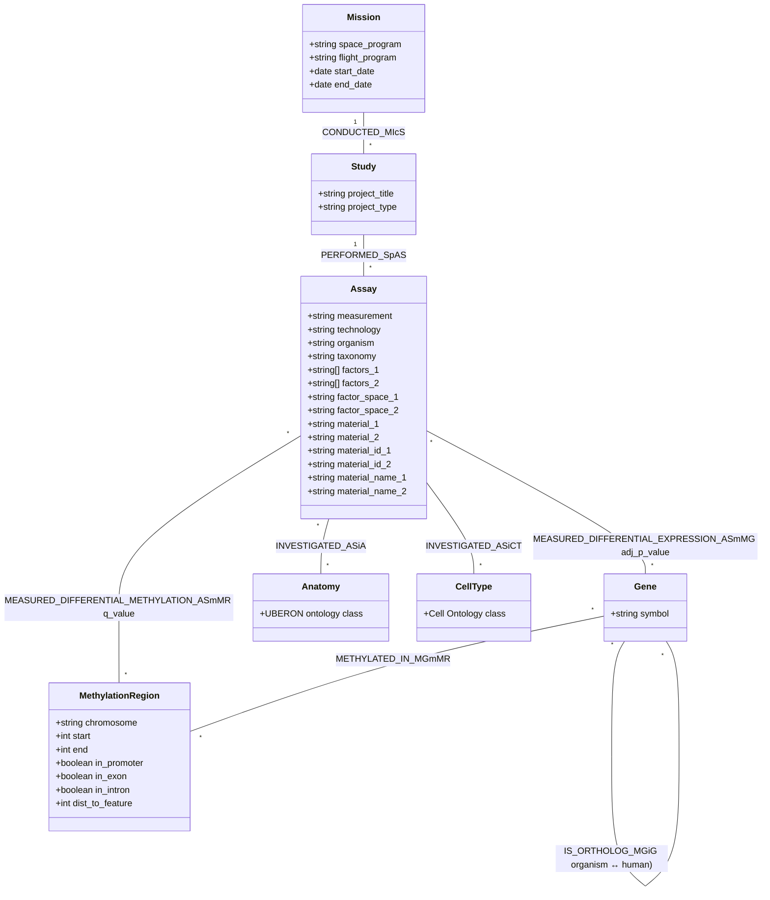

# SPOKE GeneLab Knowledge Graph Exploration

👤 **User**  
@spoke-genelab

---

🧠 **Assistant**  
I'll help you explore the SPOKE GeneLab knowledge graph. Let me start by getting information about this resource.

Great! I can help you explore the **SPOKE GeneLab** knowledge graph. This is a specialized knowledge graph that integrates omics data from NASA's Open Science Data Repository (OSDR/GeneLab), which contains results from spaceflight experiments.

**Key features of SPOKE GeneLab:**
- Integrates transcriptional profiling (RNA-Seq, DNA microarray) and epigenomic profiling (DNA methylation) data
- Contains data from model organisms in spaceflight experiments vs ground controls
- Includes pre-computed differential expression and methylation signatures
- Maps genes from model organisms to human orthologs for integration with broader biological networks
- Links to pathways, phenotypes, and therapeutic targets

## Available Entity Types:
- **Study** - NASA OSDR study instances
- **Mission** - NASA mission instances
- **Assay** - Individual experimental assays
- **Gene** - Human and model organism genes (ENTREZ IDs)
- **Anatomy** - Anatomical entities (UBERON ontology)
- **CellType** - Cell types examined (Cell Ontology)
- **MethylationRegion** - 1,000 base pair genomic regions with differential methylation

## Key Relationships:
- Missions conduct studies
- Studies perform assays
- Assays investigate anatomy and cell types
- Assays measure differential gene expression and methylation
- Model organism genes are orthologs of human genes
- Genes can be methylated in specific regions

## What would you like to explore?

Here are some example questions you could ask:
- What spaceflight missions are in the database?
- Which genes show the most significant differential expression in spaceflight?
- What organisms have been studied in space?
- Which anatomical regions or cell types have been investigated?
- What are the most studied biological pathways in spaceflight experiments?

Just let me know what interests you, and I can query the knowledge graph to find the information!

---

👤 **User**  
Visualize the schema

---

🧠 **Assistant**  
I'll create a Mermaid class diagram visualizing the SPOKE GeneLab schema. Let me generate the raw diagram first, then clean it.

Here's the visual schema of the SPOKE GeneLab knowledge graph:

This diagram shows the structure of the SPOKE GeneLab knowledge graph. The hierarchical flow goes from **Mission → Study → Assay**, with assays investigating specific anatomical regions and cell types, while measuring differential gene expression and DNA methylation changes in spaceflight experiments compared to ground controls.

---

*Created by [mcp-proto-okn](https://github.com/sbl-sdsc/mcp-proto-okn) 0.4.0 using claude-sonnet-4-20250514 on 2025-12-22*
