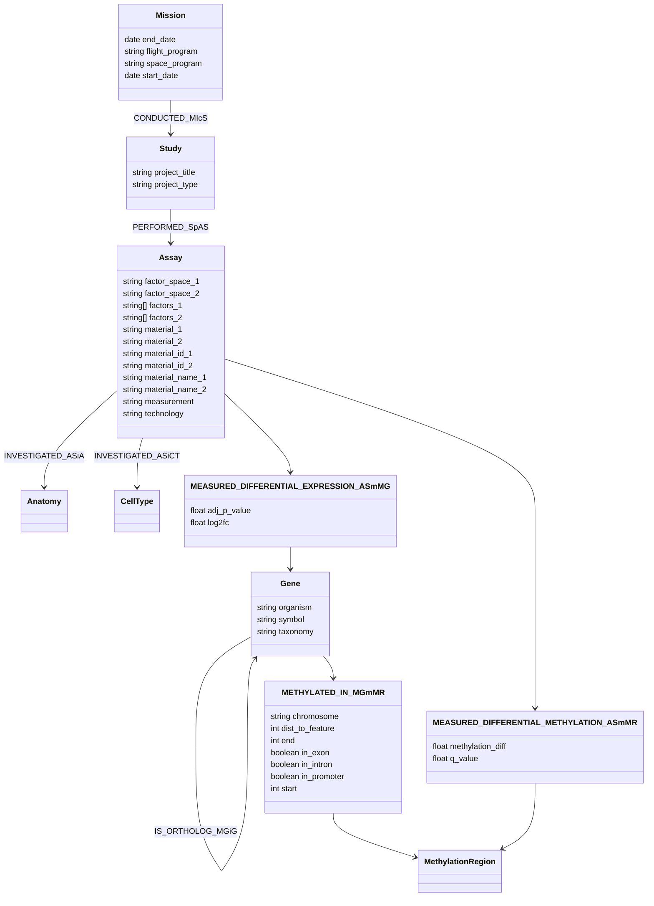

# SPOKE GeneLab Schema Visualization

👤 **User**  
@spoke-genelab

---

🧠 **Assistant**  
I'll help you explore the spoke-genelab knowledge graph. Let me first get some information about this resource.

Great! I'm now working with the **SPOKE GeneLab** knowledge graph. This is a specialized resource that integrates omics data from NASA's Open Science Data Repository (GeneLab), focusing on spaceflight experiments.

This knowledge graph includes:
- **Transcriptional profiling** data (RNA-Seq, DNA microarray)
- **Epigenomic profiling** data (DNA methylation)
- **Model organisms** flown in space or maintained as ground controls
- Pre-computed **differential expression and methylation signatures**
- **Cross-species mapping** to human orthologs
- Integration with **SPOKE's human biology network** (pathways, phenotypes, therapeutic targets)
- **Cell and tissue type mappings** to standard ontologies (CL and UBERON)

What would you like to explore? I can help you:
- Understand the structure of the data (view the schema)
- Search for specific genes, studies, or experimental conditions
- Analyze differential expression or methylation patterns
- Explore relationships between spaceflight conditions and biological responses
- Compare data across different organisms or tissue types

What are you interested in learning about?

---

👤 **User**  
Visualize the schema

---

🧠 **Assistant**  
Let me visualize the SPOKE GeneLab schema for you. I'll start by retrieving the schema information.

Perfect! Now let me create the Mermaid class diagram:

Here's the SPOKE GeneLab schema visualization! The diagram shows:

**Core Entities:**
- **Mission** → **Study** → **Assay**: The organizational hierarchy of spaceflight experiments
- **Gene**: Genetic elements from model organisms, with ortholog mappings to human genes
- **Anatomy** & **CellType**: Biological contexts investigated in assays
- **MethylationRegion**: Genomic regions showing differential methylation

**Key Relationships with Quantitative Data** (shown as intermediary classes):
- **MEASURED_DIFFERENTIAL_EXPRESSION**: Links assays to genes with log2 fold change and adjusted p-values
- **MEASURED_DIFFERENTIAL_METHYLATION**: Links assays to methylation regions with methylation differences and q-values
- **METHYLATED_IN**: Connects genes to methylation regions with detailed genomic location data (chromosome, position, overlap with exons/introns/promoters)

This structure enables powerful queries to explore how spaceflight affects gene expression and DNA methylation across different organisms and tissue types!

---

*Created by [mcp-proto-okn](https://github.com/sbl-sdsc/mcp-proto-okn) 0.4.0 on 2025-12-31*

Model: claude-sonnet-4-20250514
