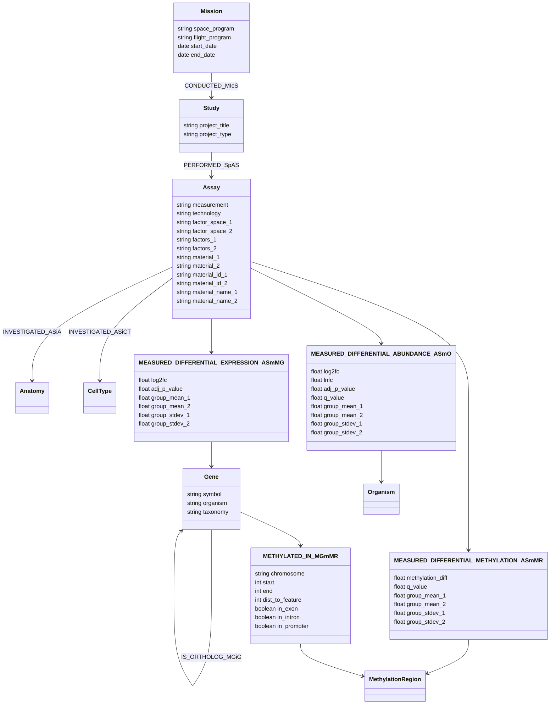

# SPOKE GeneLab Knowledge Graph Exploration

👤 **User**
@spoke-genelab

---

🧠 **Assistant**
Here's an overview of the **SPOKE GeneLab** knowledge graph:

---

## SPOKE GeneLab (`spoke-genelab`)

**What it is:** A knowledge graph that integrates omics data from NASA's Open Science Data Repository (OSDR/GeneLab) — covering results from spaceflight experiments — with SPOKE's rich human biology network.

**Domains:** Genomics · Space Biology · Biology

**What data it contains:**
- **Transcriptional profiling** (RNA-Seq, DNA microarray) — differential expression between spaceflight and ground controls
- **Epigenomic profiling** (DNA methylation) — differential methylation signatures
- **Metagenomic profiling** (amplicon sequencing) — differential abundance
- **Ortholog mapping** — model organism genes mapped to human orthologs, enabling integration with SPOKE's pathways, phenotypes, and therapeutic targets
- **Ontology-mapped anatomy/cell types** — using UBERON and Cell Ontology (CL)

**Entity types:** Assay, Anatomy, CellType, Gene, Study, MethylationRegion, Mission, Organism

**Key relationships:**
- `MEASURED_DIFFERENTIAL_EXPRESSION_ASmMG` — gene expression changes in assays
- `MEASURED_DIFFERENTIAL_METHYLATION_ASmMR` — methylation changes
- `MEASURED_DIFFERENTIAL_ABUNDANCE_ASmO` — microbial abundance changes
- `IS_ORTHOLOG_MGiG` — cross-species gene orthology
- `PERFORMED_SpAS` — missions → assays

**Identifier namespaces:** NCBI Gene, Gene Symbol, UBERON, Cell Ontology (CL)

**SPARQL endpoint:** `https://frink.apps.renci.org/spoke-genelab/sparql`

---

👤 **User**
@spoke-genelab: visualize the schema

---

🧠 **Assistant**
Here's the full schema for **SPOKE GeneLab**:

```mermaid
classDiagram
  direction TB

  class Mission {
    string space_program
    string flight_program
    date start_date
    date end_date
  }

  class Study {
    string project_title
    string project_type
  }

  class Assay {
    string measurement
    string technology
    string factor_space_1
    string factor_space_2
    string factors_1
    string factors_2
    string material_1
    string material_2
    string material_id_1
    string material_id_2
    string material_name_1
    string material_name_2
  }

  class Gene {
    string symbol
    string organism
    string taxonomy
  }

  class Anatomy

  class CellType

  class MethylationRegion

  class Organism

  class MEASURED_DIFFERENTIAL_EXPRESSION_ASmMG {
    float log2fc
    float adj_p_value
    float group_mean_1
    float group_mean_2
    float group_stdev_1
    float group_stdev_2
  }

  class MEASURED_DIFFERENTIAL_ABUNDANCE_ASmO {
    float log2fc
    float lnfc
    float adj_p_value
    float q_value
    float group_mean_1
    float group_mean_2
    float group_stdev_1
    float group_stdev_2
  }

  class MEASURED_DIFFERENTIAL_METHYLATION_ASmMR {
    float methylation_diff
    float q_value
    float group_mean_1
    float group_mean_2
    float group_stdev_1
    float group_stdev_2
  }

  class METHYLATED_IN_MGmMR {
    string chromosome
    int start
    int end
    int dist_to_feature
    boolean in_exon
    boolean in_intron
    boolean in_promoter
  }

  Mission --> Study : CONDUCTED_MIcS
  Study --> Assay : PERFORMED_SpAS
  Assay --> Anatomy : INVESTIGATED_ASiA
  Assay --> CellType : INVESTIGATED_ASiCT
  Gene --> Gene : IS_ORTHOLOG_MGiG

  Assay --> MEASURED_DIFFERENTIAL_EXPRESSION_ASmMG
  MEASURED_DIFFERENTIAL_EXPRESSION_ASmMG --> Gene

  Assay --> MEASURED_DIFFERENTIAL_ABUNDANCE_ASmO
  MEASURED_DIFFERENTIAL_ABUNDANCE_ASmO --> Organism

  Assay --> MEASURED_DIFFERENTIAL_METHYLATION_ASmMR
  MEASURED_DIFFERENTIAL_METHYLATION_ASmMR --> MethylationRegion

  Gene --> METHYLATED_IN_MGmMR
  METHYLATED_IN_MGmMR --> MethylationRegion
```

A few things to note about the structure:

- **Mission → Study → Assay** forms the experimental hierarchy — missions conducted studies, which performed assays.
- **Edges with properties** (the 4 `MEASURED_*` / `METHYLATED_IN_*` relationships) are shown as intermediary classes, since they carry rich quantitative data (log2fc, p-values, methylation diff, genomic coordinates, etc.).
- **Gene → Gene** (`IS_ORTHOLOG_MGiG`) is a self-referential edge mapping model organism genes to their human orthologs — the key bridge into SPOKE's human biology network.
- **Assay** is the central hub, connecting out to Gene, Organism, MethylationRegion, Anatomy, and CellType.

---

*Created by [mcp-proto-okn](https://github.com/sbl-sdsc/mcp-proto-okn) 0.6.0 on 2026-03-17*

*Model: claude-sonnet-4-6*
