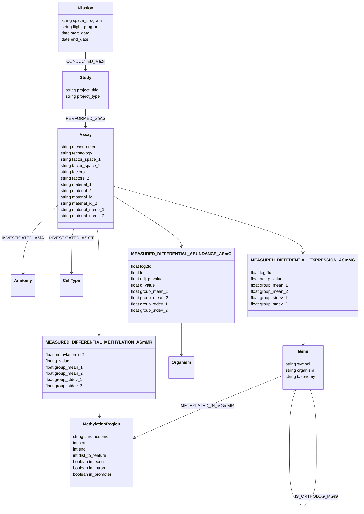

# SPOKE GeneLab Knowledge Graph Exploration

👤 **User**
@spoke-genelab

---

🧠 **Assistant**

Here's an overview of the **SPOKE GeneLab** knowledge graph:

---

## 🛰️ SPOKE GeneLab (`spoke-genelab`)

**SPOKE GeneLab** integrates omics data from NASA's [Open Science Data Repository (OSDR/GeneLab)](https://osdr.nasa.gov/bio/repo/), which hosts results from **spaceflight experiments**. It complements the broader SPOKE (Scalable Precision Medicine Open Knowledge Engine) network.

### What's in it?

**Data types included:**
- Transcriptional profiling (RNA-Seq, DNA microarray)
- Epigenomic profiling (DNA methylation)
- Metagenomic profiling (Amplicon sequencing)

All data compares **spaceflight vs. ground control** conditions in model organisms. Genes from model organisms are mapped to **human orthologs**, enabling integration with human biology (pathways, phenotypes, therapeutic targets).

---

### Entity Types

| Class | Description |
|---|---|
| `Study` | GeneLab/OSDR experiment |
| `Mission` | NASA spaceflight mission |
| `Assay` | Individual omics assay |
| `Organism` | Model organism (mouse, rat, etc.) |
| `Gene` | Gene (NCBI Gene IDs, also gene symbols) |
| `Anatomy` | Tissue/organ (UBERON ontology) |
| `CellType` | Cell type (Cell Ontology / CL) |
| `MethylationRegion` | Genomic region with methylation data |

### Key Relationships

- `PERFORMED_SpAS` — Mission → Assay
- `INVESTIGATED_ASiA` / `INVESTIGATED_ASiCT` — Assay → Anatomy / CellType
- `MEASURED_DIFFERENTIAL_EXPRESSION_ASmMG` — Assay ↔ Gene (with fold-change, p-value, etc.)
- `MEASURED_DIFFERENTIAL_METHYLATION_ASmMR` — Assay ↔ MethylationRegion
- `IS_ORTHOLOG_MGiG` — Model organism Gene → Human Gene

---

### Example Questions You Can Ask

- What genes are differentially expressed in spaceflight experiments?
- What methylation changes occur in spaceflight studies?
- What are the mouse orthologs of human disease genes?

---

Would you like to query this graph? I can help you explore specific genes, studies, missions, or differential expression results. What are you interested in?

---

👤 **User**
Visualize the schema

---

🧠 **Assistant**

Here's the schema diagram for **SPOKE GeneLab**:

```mermaid
classDiagram
direction TB

class Mission {
  string space_program
  string flight_program
  date start_date
  date end_date
}

class Study {
  string project_title
  string project_type
}

class Assay {
  string measurement
  string technology
  string factor_space_1
  string factor_space_2
  string factors_1
  string factors_2
  string material_1
  string material_2
  string material_id_1
  string material_id_2
  string material_name_1
  string material_name_2
}

class Gene {
  string symbol
  string organism
  string taxonomy
}

class Anatomy

class CellType

class MethylationRegion {
  string chromosome
  int start
  int end
  int dist_to_feature
  boolean in_exon
  boolean in_intron
  boolean in_promoter
}

class Organism

class MEASURED_DIFFERENTIAL_EXPRESSION_ASmMG {
  float log2fc
  float adj_p_value
  float group_mean_1
  float group_mean_2
  float group_stdev_1
  float group_stdev_2
}

class MEASURED_DIFFERENTIAL_METHYLATION_ASmMR {
  float methylation_diff
  float q_value
  float group_mean_1
  float group_mean_2
  float group_stdev_1
  float group_stdev_2
}

class MEASURED_DIFFERENTIAL_ABUNDANCE_ASmO {
  float log2fc
  float lnfc
  float adj_p_value
  float q_value
  float group_mean_1
  float group_mean_2
  float group_stdev_1
  float group_stdev_2
}

Mission --> Study : CONDUCTED_MIcS
Study --> Assay : PERFORMED_SpAS
Assay --> Anatomy : INVESTIGATED_ASiA
Assay --> CellType : INVESTIGATED_ASiCT
Gene --> Gene : IS_ORTHOLOG_MGiG
Gene --> MethylationRegion : METHYLATED_IN_MGmMR

Assay --> MEASURED_DIFFERENTIAL_EXPRESSION_ASmMG
MEASURED_DIFFERENTIAL_EXPRESSION_ASmMG --> Gene

Assay --> MEASURED_DIFFERENTIAL_METHYLATION_ASmMR
MEASURED_DIFFERENTIAL_METHYLATION_ASmMR --> MethylationRegion

Assay --> MEASURED_DIFFERENTIAL_ABUNDANCE_ASmO
MEASURED_DIFFERENTIAL_ABUNDANCE_ASmO --> Organism
```

The schema flows top-to-bottom: **Mission → Study → Assay**, which then fans out to anatomy/cell type context and three edge classes with quantitative properties (differential expression, methylation, and microbial abundance), each linking to their respective target nodes (**Gene**, **MethylationRegion**, **Organism**). The **Gene → Gene** self-loop captures ortholog mapping between model organism and human genes.

---

*Created by [mcp-proto-okn](https://github.com/sbl-sdsc/mcp-proto-okn) 0.6.0 on 2026-03-18*

*Model: claude-sonnet-4-6*
