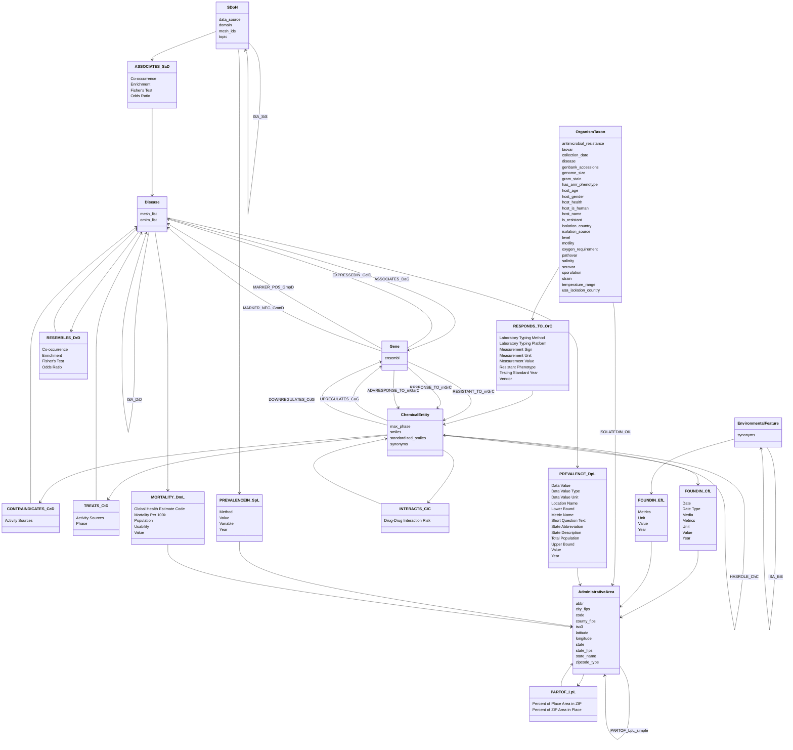

# SPOKE-OKN Schema Visualization

## Chat Transcript

👤 **User**  
@spoke-okn

---

🧠 **Assistant**  
I'll help you explore the SPOKE-OKN knowledge graph! Let me first get some information about this resource.

Great! I can help you work with the **SPOKE-OKN (SPOKE Open Knowledge Network)** knowledge graph. This is a comprehensive biomedical and environmental health knowledge graph that integrates diverse data across genomics, environmental science, and public health.

**Key features of SPOKE-OKN:**
- Integrates data on organisms, genes, diseases, chemical compounds, social determinants of health, and environmental contexts
- Includes detailed geographic information (countries down to ZIP codes)
- Supports spatial analyses of health outcomes, environmental exposures, and socioeconomic factors
- Maintained by the Baranzini Lab at UCSF

**What would you like to explore?** I can help you:
- Understand what types of data are available (genes, diseases, locations, environmental factors, etc.)
- Search for specific information (e.g., genes related to diseases, environmental exposures in certain areas)
- Analyze relationships between different entities
- Visualize the knowledge graph structure

Would you like me to show you the schema to see what kinds of data and relationships are available, or do you have a specific question you'd like to explore?

---

👤 **User**  
Visualize the schema

---

🧠 **Assistant**  
I'll visualize the schema for you. Let me first get the schema information and then create a visual diagram.

Here's a visual representation of the SPOKE-OKN knowledge graph schema! 

**Key Components:**

**7 Main Entity Types:**
- **SDoH** (Social Determinants of Health) - social and economic factors affecting health
- **AdministrativeArea** - geographic locations (countries, states, counties, ZIP codes)
- **ChemicalEntity** - drugs and chemical compounds
- **Disease** - disorders and illnesses
- **EnvironmentalFeature** - environmental quality entities
- **Gene** - units of heredity
- **OrganismTaxon** - bacterial strains and organisms

**Relationship Types:**
- **Simple arrows** show direct relationships (e.g., Gene → Disease, Chemical → Gene)
- **Box-shaped relationships** contain edge properties - these store quantitative data on the relationships themselves (like disease prevalence values, drug interaction risk levels, mortality rates, etc.)

The diagram shows how SPOKE-OKN integrates biomedical, environmental, and geographic data to support research on health outcomes, environmental exposures, and social determinants of health.

---

*Created by [mcp-proto-okn](https://github.com/sbl-sdsc/mcp-proto-okn) 0.4.0 on 2025-12-31*

Model: claude-sonnet-4-20250514
