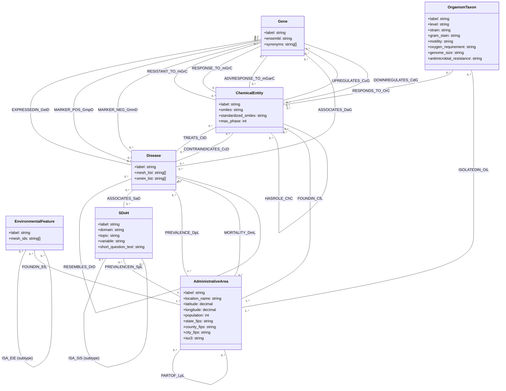

# SPOKE-OKN Knowledge Graph Exploration
## Chat Transcript

### Date: December 11, 2025

---

## User Request

> @spoke-okn

---

## Initial Discovery

I explored the SPOKE-OKN knowledge graph, which is a comprehensive biomedical and environmental health knowledge graph that integrates diverse data across genomics, environmental science, and public health.

### Overview
- **Endpoint**: https://frink.apps.renci.org/spoke-okn/sparql
- **Homepage**: https://spoke.ucsf.edu
- **PI**: Sergio Baranzini (sergio.baranzini@ucsf.edu)
- **Funding**: NSF Award #2333819

### Description
The spoke-okn (SPOKE Open Knowledge Network) KG is a comprehensive biomedical and environmental health knowledge graph that integrates diverse data across genomics, environmental science, and public health. It encompasses multiple primary entity types, including organisms, geographic locations (from countries to ZIP codes), genes, diseases, chemical compounds, social determinants of health, and environmental contexts. With detailed hierarchical coverage of geographic information, spoke-okn supports spatial analyses of health outcomes, environmental exposures, and socioeconomic factors across a range of geographic scales.

---

## Knowledge Graph Structure

### Main Entity Types (7 Classes)

1. **Gene** - Units of heredity determining biological characteristics
2. **Disease** - Disorders or illnesses affecting health
3. **Chemical Entity** - Chemical substances and compounds
4. **Environmental Feature** - Environmental quality entities
5. **Organism Taxon** - Classifications of living organisms (including bacterial strains)
6. **Administrative Area** - Geographic regions (countries, states, counties, cities, ZIP codes)
7. **Social Determinants of Health (SDoH)** - Social/economic factors influencing health

### Relationship Categories (124 predicates)

#### Disease-Related
- Disease-Gene associations
- Disease-SDoH associations  
- Disease prevalence and mortality by location
- Drug treatments and contraindications
- Disease subtypes and similarities

#### Chemical/Drug-Related
- Drug-drug interactions
- Gene upregulation/downregulation by compounds
- Antimicrobial resistance patterns
- Chemical roles and hierarchies
- Treatment and contraindication relationships

#### Geographic
- Hierarchical location relationships (city in county in state in country)
- Disease prevalence/mortality by location
- Environmental features and chemical compounds found in locations
- SDoH prevalence by location

#### Gene-Related
- Gene expression in diseases
- Positive/negative disease markers
- Drug response variants
- Pharmacogenomic associations

---

## Class Diagram

---

## Key Insights

The SPOKE-OKN knowledge graph provides a rich integration of:

1. **Biomedical Data**: Genes, diseases, and their associations with detailed medical coding (MeSH, OMIM, Ensembl)

2. **Pharmacological Data**: Chemical compounds, drugs, their interactions, treatment relationships, and clinical trial phases

3. **Geographic Data**: Multi-level administrative hierarchies with population and coordinate data for spatial health analysis

4. **Environmental Health**: Environmental features and chemical presence in locations with measurements and metrics

5. **Microbiological Data**: Organism taxonomy with antimicrobial resistance profiles and isolation locations

6. **Social Determinants**: Health factors organized by domain and topic with geographic prevalence

7. **Pharmacogenomics**: Gene variants affecting drug response, resistance, and adverse reactions

This comprehensive structure enables complex queries spanning genomics, environmental science, public health, and spatial epidemiology.

---

## Summary

The SPOKE-OKN knowledge graph is a powerful resource for:
- Investigating disease-gene associations
- Analyzing drug interactions and pharmacogenomics
- Studying geographic health disparities
- Exploring environmental health impacts
- Understanding social determinants of health
- Tracking antimicrobial resistance patterns

All data is accessible via SPARQL queries at the Frink endpoint.
