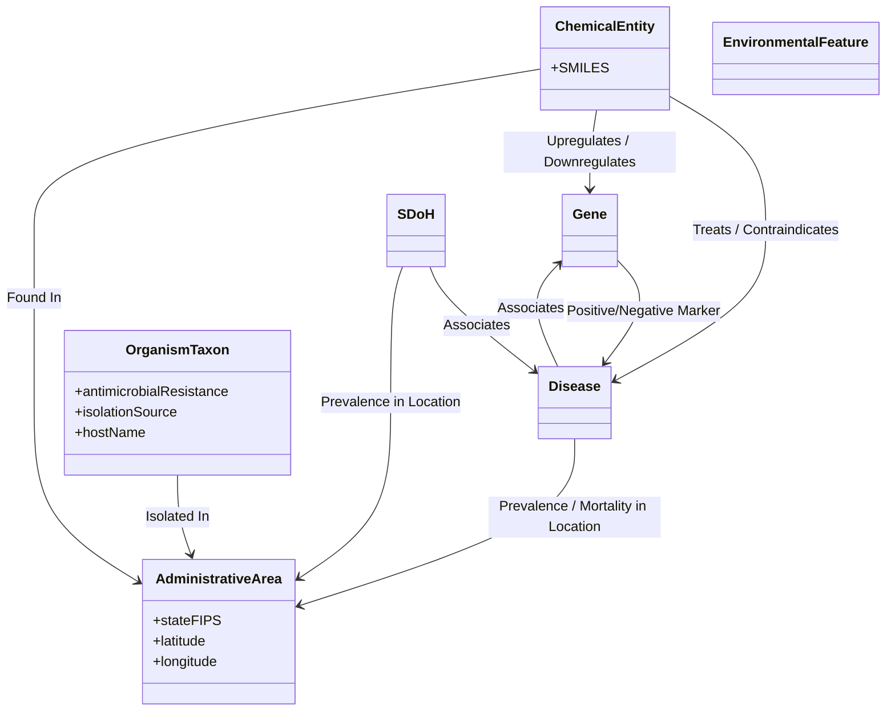

# SPOKE-OKN Knowledge Graph Exploration

## Chat Transcript

👤 **User**  
@spoke-okn

---

🧠 **Assistant**  
I'll help you explore the spoke-okn knowledge graph. Let me fetch its schema and probe the live endpoint for the classes and predicates in use.

**SPOKE-OKN** connects biomedical entities — genes, compounds, diseases, and organisms — with **social determinants of health (SDoH)** and **geography**, with an emphasis on location-based epidemiology and antimicrobial-resistance surveillance. Entities use the **Biolink Model**; edges are **reified as `rdf:Statement`s** so that relationships can carry their own properties (data source, measurement values, dates).

Live class counts:
- **~4.3 million `rdf:Statement`** — reified edges carrying edge properties
- **~321 K `OrganismTaxon`** — organism isolates (with antimicrobial-resistance and host/isolation metadata)
- **~114 K `AdministrativeArea`** — geographic areas (with FIPS codes, lat/long)
- **~16 K `Gene`**, **1,426 `SDoH`**, **798 `ChemicalEntity`**, **180 `Disease`**, `EnvironmentalFeature`

**Main relationships (biomedical):**
- `Treats` / `Contraindicates` — Compound ↔ Disease
- `Upregulates` / `Downregulates` — Compound ↔ Gene
- `Associates` — Disease ↔ Gene, and SDoH ↔ Disease
- `Positive Marker` / `Negative Marker` — Gene ↔ Disease
- `Interacts`, `Has Role`, `Is Subtype Of`, `Resembles`, `Resistant To`, `Responds To`

**Main relationships (geographic / epidemiological):**
- `Isolated In` — Organism ↔ AdministrativeArea
- `Found In` — Compound / Environment ↔ AdministrativeArea
- `Disease Prevalence in Location`, `Disease Mortality in Location`, `SDoH Prevalence in Location`

Would you like me to:
1. Visualize the schema structure?
2. Explore SDoH–disease associations by location?
3. Query antimicrobial-resistance phenotypes of organism isolates?

---

👤 **User**  
Visualize the schema

---

🧠 **Assistant**  
Here's the live schema of SPOKE-OKN — biomedical entities linked to each other and to geography/SDoH through reified relationships:

```mermaid
classDiagram
    class Gene
    class ChemicalEntity {
        +SMILES
    }
    class Disease
    class OrganismTaxon {
        +antimicrobialResistance
        +isolationSource
        +hostName
    }
    class SDoH
    class AdministrativeArea {
        +stateFIPS
        +latitude
        +longitude
    }
    class EnvironmentalFeature

    ChemicalEntity --> Disease : Treats / Contraindicates
    ChemicalEntity --> Gene : Upregulates / Downregulates
    Disease --> Gene : Associates
    SDoH --> Disease : Associates
    Gene --> Disease : Positive/Negative Marker
    OrganismTaxon --> AdministrativeArea : Isolated In
    ChemicalEntity --> AdministrativeArea : Found In
    Disease --> AdministrativeArea : Prevalence / Mortality in Location
    SDoH --> AdministrativeArea : Prevalence in Location
```

**Key insights from the schema:**

1. **Reified edges carry data.** With ~4.3 million `rdf:Statement`s, every relationship can be annotated (source, measurement value/unit, date, method) — essential for the graph's quantitative prevalence/mortality edges. Traverse via `rdf:subject` / `rdf:predicate` / `rdf:object`.

2. **Biomedical core + geography.** The Biolink classes (Gene, ChemicalEntity, Disease, OrganismTaxon) are linked to `AdministrativeArea` so biomedical facts can be grounded in place — e.g. disease prevalence or organism isolation by county/state.

3. **SDoH integration.** `SDoH` entities associate with diseases and carry prevalence-in-location edges, letting queries relate social determinants to health outcomes geographically.

4. **AMR surveillance.** `OrganismTaxon` isolates carry rich host/isolation and antimicrobial-resistance metadata (`Has Antimicrobial Resistance Phenotype`, `Isolation Country/Source`, `Resistant To` compounds), supporting resistance-surveillance questions.

---

👤 **User**  
Create transcript

---

*Created by [mcp-proto-okn](https://github.com/sbl-sdsc/mcp-proto-okn) 0.6.0 using claude-opus-4-8 on 2026-07-12*
