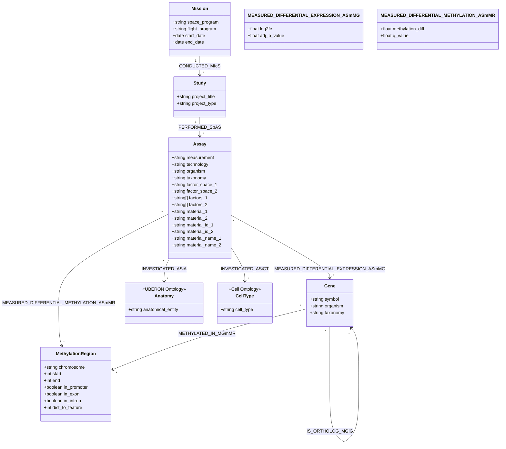

# SPOKE GeneLab Knowledge Graph Exploration

**Date:** December 10, 2025  
**Topic:** Exploring the SPOKE GeneLab Knowledge Graph via FRINK SPARQL Endpoints

---

## Conversation Transcript

### User Request 1

> @spoke-genelab

---

### Claude Response 1

I'll help you explore the SPOKE GeneLab knowledge graph! Let me start by getting information about this endpoint.

#### Knowledge Graph Description

**Source:** https://raw.githubusercontent.com/frink-okn/okn-registry/refs/heads/main/docs/registry/kgs/spoke-genelab.md

**Overview:**
The spoke-genelab KG complements the spoke-okn (SPOKE Open Knowledge Network) KG and is designed to integrate omics data from NASA's Open Science Data Repository (OSDR/GeneLab), which hosts results from spaceflight experiments.

**Key Details:**
- **Funding:** NSF Award #2333819
- **Contact:** Sergio Baranzini (sergio.baranzini@ucsf.edu)
- **SPARQL Endpoint:** https://frink.apps.renci.org/spoke-genelab/sparql
- **Homepage:** https://github.com/BaranziniLab/spoke_genelab

**Description:**
The current release includes transcriptional profiling (RNA-Seq, DNA microarray) and epigenomic profiling (DNA methylation) data from model organisms flown in space or maintained as ground controls. Differential expression and methylation signatures are pre-computed to facilitate comparisons between spaceflight and control conditions. Genes from model organisms are systematically mapped to their human orthologs, which allows integration with SPOKE's rich network of human biology, including pathways, phenotypes, and therapeutic targets. Cell and tissue types are mapped to the Cell (CL) and Uber Anatomy Ontology (UBERON) ontology, respectively.

#### Knowledge Graph Schema

**Classes (7 total):**

| Class | Label | Description |
|-------|-------|-------------|
| `http://purl.obolibrary.org/obo/OBI_0000070` | **Assay** | Unique identifier for an assay instance in the NASA Open Science Data Repository (OSDR) |
| `https://w3id.org/biolink/vocab/AnatomicalEntity` | **Anatomy** | UBERON ontology class name of an anatomical entity examined in an assay |
| `https://w3id.org/biolink/vocab/Cell` | **CellType** | Cell ontology (CL) class name of a cell type examined in an assay |
| `https://w3id.org/biolink/vocab/Gene` | **Gene** | Unique identifier for a human or model organism gene (ENTREZ id) |
| `https://w3id.org/biolink/vocab/Study` | **Study** | Unique identifier for a study instance in the NASA Open Science Data Repository (OSDR) |
| `https://purl.org/okn/frink/kg/spoke-genelab/schema/MethylationRegion` | **MethylationRegion** | Unique identifier for a 1,000 base pair genomic region exhibiting differential methylation |
| `https://purl.org/okn/frink/kg/spoke-genelab/schema/Mission` | **Mission** | Unique identifier for a mission instance in the NASA Open Science Data Repository (OSDR) |

**Key Relationships (8 predicates):**

| Predicate | Label | Description |
|-----------|-------|-------------|
| `CONDUCTED_MIcS` | Mission conducted Study | Mission conducted study |
| `INVESTIGATED_ASiA` | Assay investigated Anatomy | Assay investigated anatomy |
| `INVESTIGATED_ASiCT` | Assay investigated CellType | Assay investigated cell type |
| `IS_ORTHOLOG_MGiG` | Gene is ortholog of Gene | Model organism gene is an ortholog of a human gene |
| `MEASURED_DIFFERENTIAL_EXPRESSION_ASmMG` | Assay measured differential expression | Assay measured differential expressions of a model organism gene |
| `MEASURED_DIFFERENTIAL_METHYLATION_ASmMR` | Assay measured differential methylation | Assay measured differential methylation in a methylation region |
| `METHYLATED_IN_MGmMR` | Gene methylated in MethylationRegion | Model organism gene methylated in methylation region |
| `PERFORMED_SpAS` | Study performed Assay | Study performed assay |

**Key Properties (32 total):**

Properties include experimental factors, statistical measures (log2fc, adj_p_value, q_value), genomic coordinates (chromosome, start, end), experimental metadata (organism, technology, measurement), and mission details (start_date, end_date, space_program, flight_program).

#### Summary

This is a specialized knowledge graph that integrates **omics data from NASA's spaceflight experiments** with biological knowledge.

**Unique Capabilities:**
1. **Spaceflight vs. Control Comparisons** - Pre-computed differential expression and methylation signatures
2. **Cross-Species Integration** - Model organism genes mapped to human orthologs
3. **Rich Metadata** - Includes log2 fold changes, p-values, experimental factors, and more

Would you like me to:
- Run a specific query to explore the data?
- Show you example studies or missions?
- Investigate differential gene expression patterns?
- Explore specific organisms or tissues?

---

### User Request 2
> create class diagram

---

### Claude Response 2

I've created a class diagram for the SPOKE GeneLab knowledge graph! The diagram shows:

**Main Classes:**
- **Mission** - Space missions with program info and dates
- **Study** - Research studies from NASA OSDR
- **Assay** - Individual experiments with measurement details
- **Gene** - Human and model organism genes
- **MethylationRegion** - Genomic regions with methylation data
- **Anatomy** - Anatomical entities (UBERON ontology)
- **CellType** - Cell types (Cell Ontology)

**Key Relationships:**
- Missions conduct Studies
- Studies perform Assays
- Assays investigate Anatomy and CellTypes
- Assays measure differential expression in Genes (with log2fc and p-values)
- Assays measure differential methylation in MethylationRegions
- Genes map to human orthologs
- Genes are methylated in MethylationRegions

The diagram captures the flow from space missions → studies → assays → biological measurements, showing how spaceflight affects gene expression and methylation patterns.

---

## Mermaid Class Diagram

---

## Files Created

1. **spoke_genelab_schema.mermaid** - Mermaid class diagram file
2. **spoke_genelab_conversation_export.md** - This comprehensive markdown export

---

## Summary

This conversation explored the SPOKE GeneLab Knowledge Graph, a specialized biomedical knowledge graph that integrates NASA spaceflight experiment data with biological knowledge. The key achievement was creating a comprehensive class diagram that visualizes the relationships between missions, studies, assays, genes, methylation regions, and biological entities.

The knowledge graph enables researchers to:
- Compare spaceflight vs. ground control conditions
- Analyze differential gene expression and methylation
- Map model organism data to human biology
- Integrate multi-omics data from space experiments

**Endpoint:** https://frink.apps.renci.org/spoke-genelab/sparql  
**PI:** Sergio Baranzini, UCSF  
**Funding:** NSF Award #2333819
