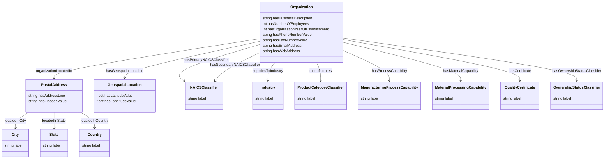

# Chat Transcript: SUDOKN Knowledge Graph Exploration

👤 **User**  
@sudokn

---

🧠 **Assistant**  
I'll help you explore the sudokn knowledge graph! Let me start by getting some information about this knowledge graph.

Great! Now let me get the schema to understand what data is available in this knowledge graph.

Perfect! I now have all the information about the SUDOKN knowledge graph. Let me provide you with a comprehensive overview.

# SUDOKN Knowledge Graph

**SUDOKN** (Supply and Demand Open Knowledge Network) is a specialized knowledge graph focused on **manufacturing capabilities of Small and Medium-Sized Manufacturers (SMMs)** across the United States.

## Key Features

SUDOKN contains detailed information about:

### 1. **Manufacturing Organizations**
- Company profiles and business information
- Geographic locations (with postal addresses and coordinates)
- Contact details (phone, email, web)
- Size metrics (number of employees)
- Year of establishment

### 2. **Manufacturing Capabilities**
The knowledge graph includes extensive information on:
- **Process capabilities**: Machining, welding, coating, casting, forming, 3D printing, and many more
- **Material processing**: Metals (aluminum, steel, titanium, etc.), plastics, composites, ceramics, and more
- Specialized capabilities like CNC machining, precision welding, surface treatments

### 3. **Industry Classifications**
- **NAICS codes**: Detailed industry classifications
- **Industry sectors**: Aerospace, automotive, electronics, medical devices, defense, and more
- Product categories that manufacturers supply

### 4. **Quality Certifications**
Manufacturers can have various certifications including:
- ISO certifications (9001, 13485, 14001, etc.)
- AS9100 (aerospace)
- FDA certifications
- ITAR compliance
- And many others

### 5. **Business Characteristics**
- Ownership status (minority-owned, woman-owned, veteran-owned, etc.)
- Special designations (HUBZone, small disadvantaged business)

## What Can You Do With SUDOKN?

You can use this knowledge graph to:
- Find manufacturers by capability (e.g., "Find companies that do laser cutting and welding")
- Search by location and industry
- Identify suppliers with specific certifications
- Match manufacturers to product categories
- Analyze manufacturing capabilities by region
- Find diverse suppliers (woman-owned, veteran-owned, etc.)

Would you like me to:
1. Show you some example queries?
2. Find specific manufacturers or capabilities?
3. Create visualizations of the data?
4. Explore a particular industry or region?

Just let me know what you'd like to explore!

---

👤 **User**  
Visualize schema

---

🧠 **Assistant**  
I'll create a visualization of the SUDOKN knowledge graph schema for you.

Now let me generate the schema visualization following the workflow:

**Step 1-2**: I already have the schema from earlier, so I'll analyze it to identify the main components.

**Step 3-5**: Let me generate the draft Mermaid diagram:

**Step 10-13**: Now I'll present the cleaned diagram and save it to a file:

Perfect! I've created a schema visualization for the SUDOKN knowledge graph. The diagram shows:

## Core Structure

**Central Entity**: **Organization** (manufacturers)
- Contains business information (description, employee count, establishment year, contact details)

**Connected to**:
- **PostalAddress** → **City**, **State**, **Country** (geographic hierarchy)
- **GeospatialLocation** (latitude/longitude coordinates)
- **NAICSClassifier** (primary and secondary industry codes)
- **Industry** (industries they supply to)
- **ProductCategoryClassifier** (products they manufacture)
- **ManufacturingProcessCapability** (manufacturing processes like CNC, welding, etc.)
- **MaterialProcessingCapability** (materials they work with)
- **QualityCertificate** (ISO, AS9100, FDA certifications, etc.)
- **OwnershipStatusClassifier** (woman-owned, veteran-owned, etc.)

The visualization is now available as a downloadable Mermaid diagram file that you can use in documentation or presentations!

---

*Created by [mcp-proto-okn](https://github.com/sbl-sdsc/mcp-proto-okn) 0.5.0 on 2026-01-17*

Model: Claude Sonnet 4.5 (claude-sonnet-4-5-20250929)
