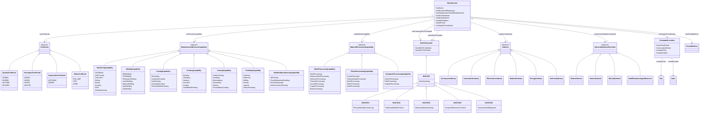

# SUDOKN Knowledge Graph Exploration - Chat Transcript

## Exploring the Supply and Demand Open Knowledge Network

---

👤 **User**  
@sudokn

---

🧠 **Claude**  
I'll help you explore the SUDOKN knowledge graph. Let me start by getting information about this endpoint.

Great! I can now help you explore the **SUDOKN (Supply and Demand Open Knowledge Network)** - a specialized knowledge graph focused on manufacturing capability data for Small and Medium-Sized Manufacturers (SMMs) in the United States.

## About SUDOKN

SUDOKN contains detailed information about:
- **Manufacturing organizations** and their locations
- **Process capabilities**: machining, welding, coating, finishing, 3D printing
- **Material processing**: metals, plastics, composites
- **Quality certifications**: ISO 9000/9001, AS9100/9102
- **Industry alignments**: aerospace, automotive, electronics, food processing
- **NAICS industry classifications**

The knowledge graph uses the Industrial Ontologies Foundry (IOF) core ontologies for semantic interoperability.

**PI**: Farhad Ameri (Arizona State University)  
**Funding**: NSF Award #2333801  
**Homepage**: https://projects.engineering.asu.edu/sudokn/

---

## What would you like to explore?

I can help you:
1. **View the schema** - See what types of data and relationships are available
2. **Query manufacturers** - Find companies by capability, location, certification, or industry
3. **Analyze supply chains** - Explore supplier networks and capabilities
4. **Search by location** - Find manufacturers in specific regions
5. **Filter by certifications** - Identify quality-certified manufacturers

What interests you most about the SUDOKN manufacturing data?

---

👤 **User**  
View the schema

---

🧠 **Claude**  
Perfect! I've retrieved the SUDOKN schema. This is a comprehensive manufacturing knowledge graph. Let me create a visual summary of the key elements:

## SUDOKN Schema Overview

The SUDOKN knowledge graph contains **794 classes** and **52 predicates** (relationships). Here are the main components:

### üè≠ **Core Entities**

**Organizations:**
- `Manufacturer` - Small and Medium-Sized Manufacturing companies
- Attributes: name, employees count, year established, postal address, email, web address
- Location data: city, state, ZIP code, latitude/longitude coordinates

### üîß **Manufacturing Capabilities**

**Process Capabilities** (400+ types):
- **Machining**: CNC Milling, CNC Turning, Drilling, Boring, Grinding, EDM, Swiss Machining
- **Welding**: MIG, TIG, Plasma Arc, Laser, Robotic, Spot, Gas Welding
- **Casting**: Die Casting, Investment Casting, Sand Casting, Centrifugal Casting
- **Forming**: Bending, Stamping, Drawing, Extrusion, Forging
- **Coating**: Powder Coating, Anodizing, Electroplating, Galvanizing, Painting
- **Finishing**: Polishing, Deburring, Buffing, Honing, Lapping
- **Additive Manufacturing**: 3D Printing, Fused Deposition Modeling, Stereolithography

**Material Processing Capabilities** (100+ types):
- **Metals**: Steel, Stainless Steel, Aluminum, Copper, Brass, Bronze, Titanium, Inconel
- **Plastics**: Acrylic, Polycarbonate, Nylon, Teflon, Delrin, Urethane
- **Composites**: Carbon, Fiberglass, Graphite
- **Specialty**: Ceramics, Glass, Exotic Materials

### üìú **Certifications**

**Quality Certifications**:
- ISO 9001/9000, ISO 13485, ISO 14001
- AS9100/9102/9120 (Aerospace)
- IATF 16949 (Automotive)
- FDA GMP, NADCAP, ITAR Compliant

### 🏢 **Industry Alignments**

**Industries Served** (40+ types):
- Aerospace, Automotive, Electronics, Medical/Healthcare
- Energy, Oil & Gas, Defense/Military
- Food & Beverage, Pharmaceutical
- Communications, Construction, Agriculture

### üìä **NAICS Classifications**

**NAICS Codes** (200+ codes):
- NAICS 33 - Manufacturing
- NAICS 331 - Primary Metal Manufacturing
- NAICS 332 - Fabricated Metal Products
- NAICS 333 - Machinery Manufacturing
- NAICS 334 - Computer/Electronic Products
- NAICS 335 - Electrical Equipment
- NAICS 336 - Transportation Equipment
- NAICS 337 - Furniture

### 🏷️ **Ownership Status**

- Women Owned
- Veteran Owned
- Minority Owned
- Small Disadvantaged Business
- Native American Owned

### üîó **Key Relationships**

- `hasProcessCapability` - Links manufacturers to their capabilities
- `hasMaterialCapability` - Links to materials they can process
- `hasCertificate` - Quality/compliance certifications
- `suppliesToIndustry` - Industries they serve
- `hasNAICSClassifier` - Industry classification codes
- `organizationLocatedIn` - Geographic location

---

Would you like me to:
1. **Query specific manufacturers** by capability, location, or certification?
2. **Analyze capabilities** - Find manufacturers with specific processes?
3. **Explore certifications** - Search by quality standards?
4. **Geographic analysis** - Find manufacturers in specific regions?
5. **Create a visual diagram** of the schema relationships?

---

👤 **User**  
Create a visual diagram

---

🧠 **Claude**  
Perfect! Here's the **SUDOKN Knowledge Graph Schema Visualization**:

## üìä Key Insights from the Schema Diagram

This visual representation shows how SUDOKN organizes manufacturing data:

**Central Entity**: `Manufacturer` (the hub of all relationships)

**Six Main Relationship Categories**:

1. **üîß Process Capabilities** - What manufacturers can DO (400+ specific capabilities)
   - Machining, Welding, Casting, Forming, Coating, Finishing, Additive Manufacturing

2. **üß± Material Capabilities** - What they can WORK WITH
   - Metals, Plastics, Composites (100+ specific materials)

3. **üìú Certifications** - Quality assurance and compliance
   - ISO, AS, IATF, FDA, ITAR, NADCAP standards

4. **🏢 Industry Alignments** - Who they SERVE
   - Aerospace, Automotive, Electronics, Medical, Energy, Defense

5. **🏷️ Classifications** - Industry codes and ownership status
   - NAICS codes (hierarchical industry classification)
   - Ownership: Women, Veteran, Minority owned

6. **üìç Location Data** - WHERE they are
   - Address, City, State, GPS coordinates

This schema enables powerful queries like "Find all AS9100-certified manufacturers in Ohio with CNC milling and titanium processing capabilities that serve the aerospace industry."

Would you like me to run some example queries to show the data in action?

---

👤 **User**  
create a transcript

---

🧠 **Claude**  
*Creating this transcript document...*

---

*Created by [mcp-proto-okn](https://github.com/sbl-sdsc/mcp-proto-okn) on 2025-12-15*
