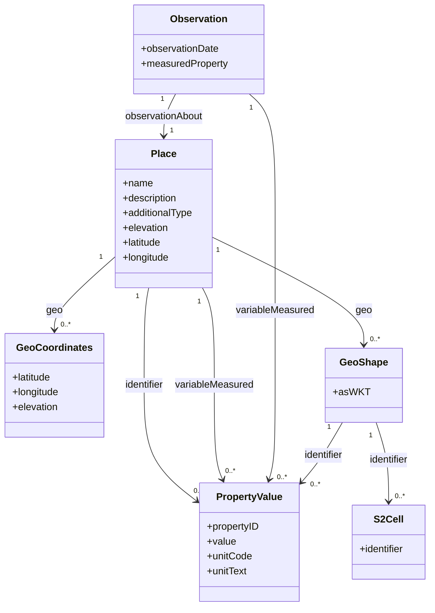

# Chat Transcript: Urban Flooding Open Knowledge Network (UF-OKN)

👤 **User**  
@ufokn

---

🧠 **Assistant**  
I'll help you explore the UFO Knowledge Graph. Let me first get information about this knowledge graph to understand what data is available.

Great! I can see the **Urban Flooding Open Knowledge Network (UF-OKN)** is now accessible. This is a geospatial knowledge graph that integrates urban infrastructure data with hydrologic forecasts to assess flood risk.

**Key Features:**
- **Coverage**: 24 years of historical flood data across the continental United States
- **Data Sources**: OpenStreetMap urban infrastructure, NOAA National Water Model, HEC-RAS, SWMM
- **Risk-Points™**: Locations where built and natural environments interact with potential flood impacts

**Available Data Classes:**
- **Place**: Urban infrastructure (buildings, roads, stormwater networks, power stations)
- **GeoShape/GeoCoordinates**: Geographic locations and boundaries
- **Observation**: Hydrologic measurements and forecasts
- **PropertyValue**: Attribute measurements
- **S2Cell**: Spatial grid cells for geographic indexing

**What would you like to explore?** I can help you:
- Find infrastructure at risk in specific locations
- Query historical flood observations
- Analyze flood risk for particular types of infrastructure (buildings, roads, etc.)
- Explore hydrologic forecasts and models
- Examine Risk-Points in areas of interest

What aspect of urban flooding data interests you?

---

👤 **User**  
Visualize schema

---

🧠 **Assistant**  
Here's the **Urban Flooding Open Knowledge Network (UF-OKN) Schema**:

**Schema Overview:**

- **Place**: Core entity representing urban infrastructure (buildings, roads, stormwater systems, power stations). Can have geographic coordinates or shapes, and various measured properties.

- **GeoCoordinates & GeoShape**: Spatial representations - point coordinates or polygon/line geometries (using WKT format).

- **Observation**: Hydrologic measurements and forecasts linked to specific places and dates, containing measured variables.

- **PropertyValue**: Flexible key-value pairs for identifiers, measurements, and attributes with units.

- **S2Cell**: Google's S2 spatial indexing system for efficient geographic queries.

This schema enables querying infrastructure at risk by linking places to their geographic locations, flood observations, and spatial cells for efficient geographic analysis.

---

*Created by [mcp-proto-okn](https://github.com/sbl-sdsc/mcp-proto-okn) on 2025-12-15*
