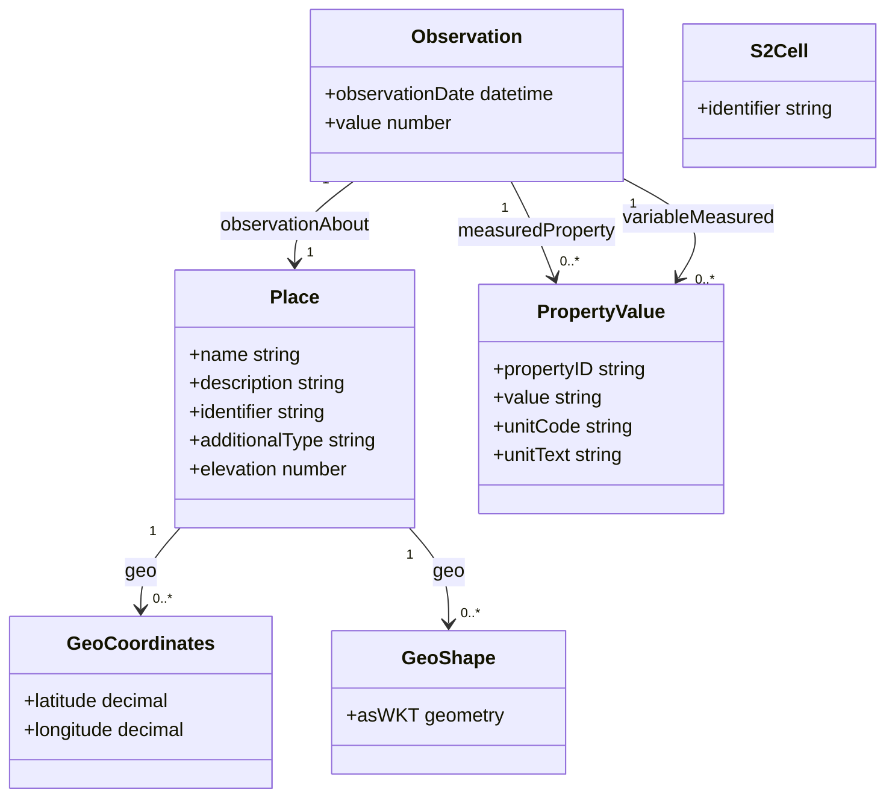

# UF-OKN Knowledge Graph Exploration

## Chat Transcript

👤 **User**  
@ufokn

---

🧠 **Assistant**  
I'll help you explore the UFOKN knowledge graph! Let me first get some information about this knowledge graph.

Great! I can help you explore the **Urban Flooding Open Knowledge Network (UF-OKN)**, a geospatial knowledge graph that integrates urban infrastructure data with hydrologic forecasts for flood risk assessment.

**About UF-OKN:**

UF-OKN is an informational infrastructure built using knowledge graphs aiming to extract structured content from the information scattered across open-source geospatial datasets and hydrologic models.

The Urban Flooding Open Knowledge Network (UF-OKN) is a geospatial knowledge graph infrastructure that integrates urban built environment data with real-time and historical hydrologic forecasts to enable flood risk assessment and emergency response. UF-OKN contains structured representations of urban infrastructure (buildings, roads, stormwater networks, power stations) derived from OpenStreetMap, linked to hydrologic features (rivers, streams) and operational forecast models including NOAA's National Water Model and local models like HEC-RAS and SWMM. The knowledge graph introduces "Risk-Points™"—locations where built and natural environments interact with potential flood impacts—providing 24-year historical analysis coverage across the continental United States. UF-OKN uses schema.org vocabularies (Place, GeoShape, GeoCoordinates, Observation, PropertyValue) and STKO spatial ontologies (S2Cell) to enable SPARQL queries connecting infrastructure vulnerability to forecast conditions. The knowledge graph supports developers building custom flood information applications, emergency management systems, and risk analysis tools for planning and real-time response.

**Schema Overview:**

The UF-OKN knowledge graph contains:

**Main Classes:**
- **Place** - Urban infrastructure elements (buildings, roads, stormwater networks, power stations)
- **GeoShape** & **GeoCoordinates** - Spatial geometries and coordinates
- **Observation** - Hydrologic measurements and forecasts
- **PropertyValue** - Attributes and characteristics
- **S2Cell** - Spatial grid cells for geographic indexing

**Key Properties:**
- Geographic: latitude, longitude, elevation, geo, asWKT (geometries)
- Descriptive: name, description, identifier, additionalType
- Observational: observationDate, observationAbout, measuredProperty, value, unitCode

This knowledge graph focuses on "Risk-Points™" where urban infrastructure intersects with flood hazards, linking places to hydrologic observations.

---

👤 **User**  
Visualize the schema

---

🧠 **Assistant**  
Here's the UF-OKN knowledge graph schema visualized:

**Key Architecture:**

- **Place** - The core entity representing urban infrastructure (buildings, roads, stormwater systems, power stations, and Risk-Points™)
- **GeoCoordinates & GeoShape** - Spatial representation using lat/long coordinates and WKT geometries
- **Observation** - Links hydrologic measurements and forecasts to specific places
- **PropertyValue** - Describes measured properties with units and values
- **S2Cell** - Google's S2 spatial indexing for efficient geographic queries

The schema enables queries that connect infrastructure vulnerability (Place) with flood forecasts (Observation) across the continental United States, supporting emergency management and risk analysis applications.

---

*Created by [mcp-proto-okn](https://github.com/sbl-sdsc/mcp-proto-okn) on 2025-12-15*
