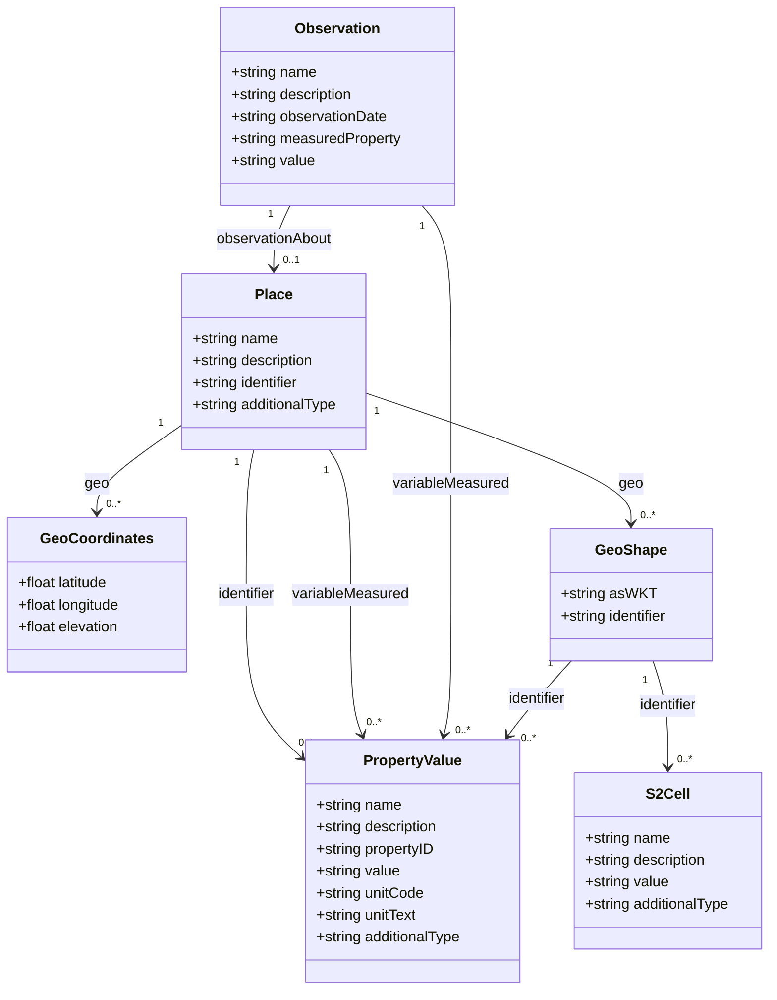

# UF-OKN Knowledge Graph Chat Transcript

## Conversation Date
December 15, 2025

---

## 👤 User
@ufokn

---

## 🤖 Claude

I can help you explore the UFOKN (Unified Framework for Open Knowledge Networks) knowledge graph! Let me start by getting information about this endpoint and its schema.

### What is UF-OKN?

UF-OKN integrates urban infrastructure data with hydrologic forecasts to enable flood risk assessment. It contains:

- **Urban infrastructure**: Buildings, roads, stormwater networks, power stations (from OpenStreetMap)
- **Hydrologic features**: Rivers, streams
- **Forecast models**: NOAA's National Water Model, HEC-RAS, SWMM
- **Risk-Points™**: Locations where built and natural environments interact with potential flood impacts
- **Coverage**: 24 years of historical analysis across the continental United States

### Available Data Classes

The knowledge graph uses schema.org vocabularies:
- **Place**: Geographic locations
- **GeoShape & GeoCoordinates**: Spatial geometries and coordinates
- **Observation**: Measurements and observations
- **PropertyValue**: Property values associated with entities
- **S2Cell**: Spatial cell indexing system

### What can I help you with?

I can help you:
1. Query flood risk data for specific locations
2. Explore infrastructure vulnerability
3. Analyze historical flooding observations
4. Find places with specific characteristics (buildings, water features, etc.)
5. Examine spatial relationships between infrastructure and hydrologic features

What would you like to explore in the UF-OKN knowledge graph?

---

## 👤 User
Create class schema

---

## 🤖 Claude

I've created a comprehensive class schema diagram for the UF-OKN knowledge graph! 

### Key Components:

**Core Classes:**
- **Place** - Geographic locations (buildings, roads, infrastructure, water features)
- **GeoCoordinates** - Point locations with latitude, longitude, and elevation
- **GeoShape** - Spatial geometries in WKT format
- **Observation** - Measurements and observations about places
- **PropertyValue** - Structured metadata and measurements
- **S2Cell** - Spatial indexing cells for efficient geospatial queries

**Key Relationships:**
- Places have geographic representations through GeoCoordinates or GeoShape
- Observations are made about Places
- PropertyValues provide structured metadata for Places, Observations, and GeoShapes
- GeoShapes are indexed using S2Cells for spatial partitioning

This schema supports the UF-OKN's mission of linking urban infrastructure to flood risk data by connecting physical places with their spatial representations, observations (like water levels), and detailed property values (like flood forecasts, infrastructure attributes, etc.).

### UF-OKN Schema Diagram

---

## About UF-OKN

**Full Name**: Urban Flooding Open Knowledge Network

**Homepage**: https://ufokn.com

**SPARQL Endpoint**: https://frink.apps.renci.org/ufokn/sparql

**Funding**: NSF Award #2333726

**Contact**: Lilit Yeghiazarian (yeghialt@ucmail.uc.edu)

**Description**: UF-OKN is an informational infrastructure built using knowledge graphs aiming to extract structured content from the information scattered across open-source geospatial datasets and hydrologic models. The Urban Flooding Open Knowledge Network is a geospatial knowledge graph infrastructure that integrates urban built environment data with real-time and historical hydrologic forecasts to enable flood risk assessment and emergency response.

---

*End of Transcript*
