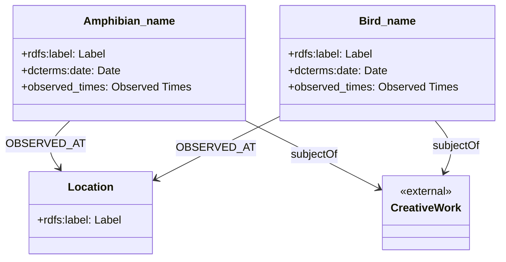

# Wildlife-KN Knowledge Graph Exploration

👤 **User**  
@wildlifekg

---

🧠 **Assistant**  
I'll help you explore the wildlife knowledge graph! Let me start by getting information about this knowledge graph.

Great! I can now help you explore the **Wildlife-KN** (Wildlife Knowledge Network). This is a comprehensive knowledge graph designed for wildlife researchers, conservation managers, and policymakers to address biodiversity challenges under climate change.

## About Wildlife-KN

This knowledge network integrates data on:
- Wildlife species (amphibians and birds)
- Geographic locations and distributions
- Observation data (when and where species were observed)
- Habitat characteristics and environmental variables

The graph connects biological observations with geospatial and temporal data to support queries about species distributions, habitat patterns, and conservation needs.

## Available Data

The schema shows three main classes:
- **Amphibian Name** - Scientific/common names of amphibian species
- **Bird Name** - Scientific/common names of bird species  
- **Location** - Geographic places where observations occur

Key relationships include:
- Species observations linked to locations (OBSERVED_AT)
- Observation frequencies (observed_times)
- Temporal information (dates)

## What would you like to explore?

I can help you with queries like:
- Which species have been observed at specific locations?
- How many times has a particular species been observed?
- What amphibians or birds are in the dataset?
- Geographic distribution patterns of species

What aspect of the wildlife data interests you?

---

👤 **User**  
Visualize the schema

---

🧠 **Assistant**  
Here's the Wildlife-KN schema visualization:

## Schema Overview

The diagram shows a straightforward structure:

**Main Classes:**
- **Amphibian_name** and **Bird_name** - Wildlife species with observation data including labels, dates, and observation frequencies
- **Location** - Geographic places where species are observed

**Key Relationships:**
- **OBSERVED_AT** - Links species observations to their geographic locations
- **subjectOf** - Connects species to external creative works (research papers, articles, etc.)

Both amphibian and bird species share the same property structure, tracking when and how often they were observed at different locations. This enables analysis of species distributions and temporal patterns across geographic areas.

---

*Created by [mcp-proto-okn](https://github.com/sbl-sdsc/mcp-proto-okn) 0.4.0 using claude-sonnet-4-20250514 on 2025-12-22*
