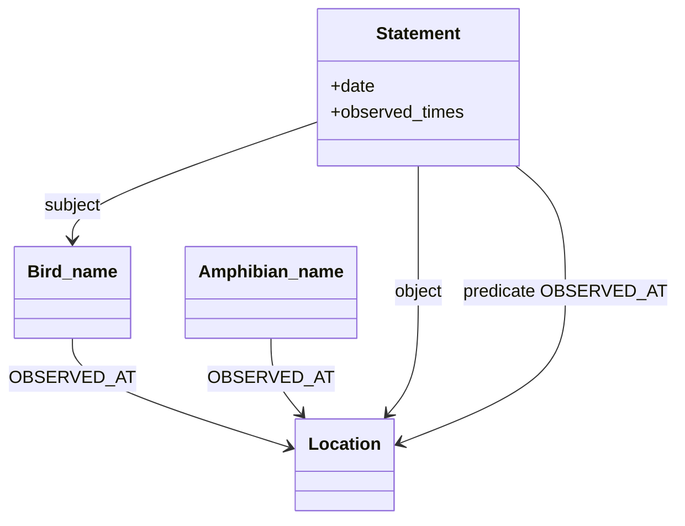

# Wildlife-KN Knowledge Graph Exploration

## Chat Transcript

👤 **User**  
@wildlifekn

---

🧠 **Assistant**  
I'll help you explore the wildlifekn knowledge graph. Let me fetch its schema and probe the live endpoint for the classes and predicates in use.

**Wildlife-KN** records **wildlife species observations by location** — which bird and amphibian species were observed where, and how often. Observations are **reified as `rdf:Statement`s** so each species-at-location observation can carry a date and an observation count.

Live class counts:
- **~5,205 `rdf:Statement`** — reified species-observation records
- **657 `Location`** — geographic places where observations occurred
- **303 `Bird_name`** and **97 `Amphibian_name`** — observed species (by common/scientific name)

**Main relationships:**
- `OBSERVED_AT` — links a species (`Bird_name` / `Amphibian_name`) to the `Location` where it was observed
- `rdf:subject` / `rdf:predicate` / `rdf:object` — the reified observation statement's parts
- `date` — when the observation was recorded
- `observed_times` — how many times the species was observed at that location
- `rdfs:label`, `schema:subjectOf` — labels and links to source records

Would you like me to:
1. Visualize the schema structure?
2. List species observed at a given location?
3. Rank locations by observation counts for a species?

---

👤 **User**  
Visualize the schema

---

🧠 **Assistant**  
Here's the live schema of Wildlife-KN — species observed at locations, with each observation reified to carry a date and count:

```mermaid
classDiagram
    class Bird_name
    class Amphibian_name
    class Location
    class Statement {
        +date
        +observed_times
    }

    Bird_name --> Location : OBSERVED_AT
    Amphibian_name --> Location : OBSERVED_AT
    Statement --> Bird_name : subject
    Statement --> Location : object
    Statement --> Location : predicate OBSERVED_AT
```

**Key insights from the schema:**

1. **Species → location observations.** The graph is a compact bipartite structure: `Bird_name` and `Amphibian_name` species link to `Location`s via `OBSERVED_AT`, capturing where each species has been seen.

2. **Reification carries the detail.** Each observation is an `rdf:Statement` (subject = species, predicate = `OBSERVED_AT`, object = location) annotated with `date` and `observed_times`, so the *when* and *how many* live on the edge rather than being lost in a plain triple.

3. **Two taxa, extensible.** Birds and amphibians are modeled as parallel species classes; the pattern generalizes to additional taxa by adding species classes that reuse the same `OBSERVED_AT` / reification structure.

4. **Occurrence analysis.** With observation counts and dates on every edge, the graph supports species-richness-by-location, hotspot, and temporal-trend queries.

---

👤 **User**  
Create transcript

---

*Created by [mcp-proto-okn](https://github.com/sbl-sdsc/mcp-proto-okn) 0.6.0 using claude-opus-4-8 on 2026-07-12*
